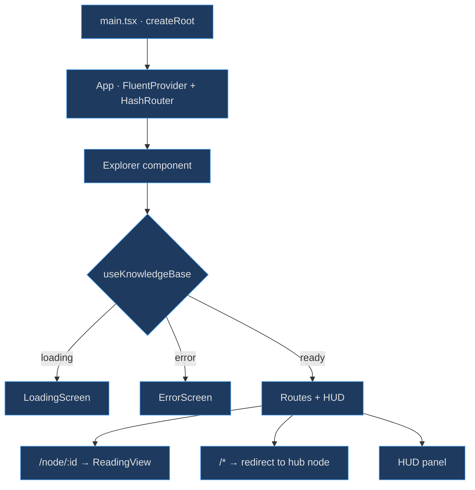
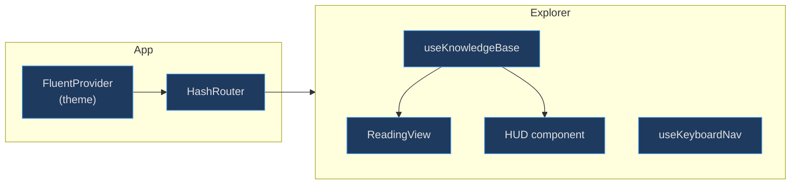

# Application Shell

The application shell exists to provide a single, stable entry point that boots the Fluent 2 design system, initialises routing, loads the knowledge graph, and coordinates every top-level UI subsystem. Without this orchestration layer every feature would need its own copy of theme wiring, route handling, and loading-state management.

## At a Glance

| Component | Responsibility | Key File | Source |
|-----------|---------------|----------|--------|
| `App` | Fluent theme provider + HashRouter host | `src/App.tsx` | [src/App.tsx:82](https://github.com/anokye-labs/kbexplorer/blob/main/src/App.tsx#L82) |
| `Explorer` | Orchestrate loading, keyboard nav, HUD, routing | `src/App.tsx` | [src/App.tsx:28](https://github.com/anokye-labs/kbexplorer/blob/main/src/App.tsx#L28) |
| `ReadingRoute` | Extract `id` param and render ReadingView | `src/App.tsx` | [src/App.tsx:17](https://github.com/anokye-labs/kbexplorer/blob/main/src/App.tsx#L17) |
| `useCurrentNodeId` | Parse hash URL for current node | `src/App.tsx` | [src/App.tsx:22](https://github.com/anokye-labs/kbexplorer/blob/main/src/App.tsx#L22) |
| `createRoot` | React 19 root mount | `src/main.tsx` | [src/main.tsx:6](https://github.com/anokye-labs/kbexplorer/blob/main/src/main.tsx#L6) |

## Boot Sequence

<!-- Sources: src/App.tsx:82-91, src/App.tsx:28-80, src/main.tsx:6-9 -->

## Component Composition

<!-- Sources: src/App.tsx:82-91, src/App.tsx:56-79 -->

## FluentProvider Wrapping

The `App` component initialises the Fluent 2 design system by calling [`useTheme`](https://github.com/anokye-labs/kbexplorer/blob/main/src/App.tsx#L83) to obtain a `themeMode`, a Fluent `Theme` token set, and a setter. The entire component tree is wrapped in `<FluentProvider theme={fluentTheme}>` at [src/App.tsx:86](https://github.com/anokye-labs/kbexplorer/blob/main/src/App.tsx#L86) so that every child has access to Fluent's CSS-in-JS tokens.

## Routing

A `HashRouter` is used (not `BrowserRouter`) because the app is deployed as a static SPA. Two routes are defined at [src/App.tsx:59-66](https://github.com/anokye-labs/kbexplorer/blob/main/src/App.tsx#L59):

| Route | Behaviour |
|-------|-----------|
| `/node/:id` | Renders `ReadingRoute`, which extracts `id` via `useParams` and passes it to `ReadingView` |
| `*` (catch-all) | Redirects to the hub node via `getHubNodeId(graph)`, falling back to the first node in the graph |

## Explorer Orchestration

The `Explorer` component at [src/App.tsx:28](https://github.com/anokye-labs/kbexplorer/blob/main/src/App.tsx#L28) is the heart of the shell. It:

1. **Loads data** — calls `useKnowledgeBase()` and renders `LoadingScreen` or `ErrorScreen` based on status ([src/App.tsx:44-45](https://github.com/anokye-labs/kbexplorer/blob/main/src/App.tsx#L44))
2. **Enables keyboard shortcuts** — passes the graph to `useKeyboardNav` ([src/App.tsx:39-42](https://github.com/anokye-labs/kbexplorer/blob/main/src/App.tsx#L39))
3. **Mounts HUD** — renders the HUD component with graph, config, current node, and theme callbacks ([src/App.tsx:69-77](https://github.com/anokye-labs/kbexplorer/blob/main/src/App.tsx#L69))

## Persisted HUD State

HUD dock position and collapsed state survive page reloads via `localStorage`:

| Key | Default | Purpose |
|-----|---------|---------|
| `kbe-hud-collapsed` | `false` | Whether the HUD panel is collapsed |
| `kbe-hud-dock` | `'bottom'` | Dock position: `top`, `bottom`, `left`, `right` |
| `kbe-sidebar-w` | `25` | Sidebar width in `vw` units when docked left/right |

These are initialised in `useState` lazy initialisers at [src/App.tsx:32-37](https://github.com/anokye-labs/kbexplorer/blob/main/src/App.tsx#L32).

## Dynamic Padding

The main content area receives dynamic padding so it never overlaps the HUD regardless of dock position. The padding computation at [src/App.tsx:50-54](https://github.com/anokye-labs/kbexplorer/blob/main/src/App.tsx#L50) accounts for:

- **Collapsed** → small `40px` padding in the dock direction
- **Left/Right dock** → padding uses `--kbe-sidebar-width` CSS custom property
- **Top/Bottom dock** → fixed `156px` padding
