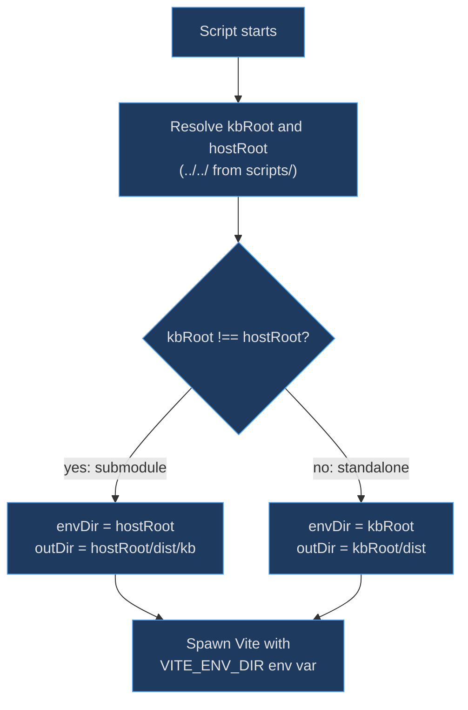
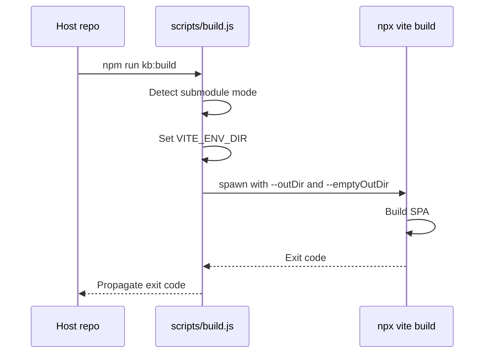

# Build & Dev Scripts

These scripts exist because kbexplorer can run either standalone or as a git submodule inside another repository. The build and dev launchers detect which mode they're in and configure [Vite](vite-config) accordingly — setting the correct `envDir` (so `.env.kbexplorer` is found in the host repo) and `outDir` (so built assets land in the right place). The [init script](init-script) generates these npm commands during setup; without them, submodule users would need manual CLI flags on every invocation.

## At a Glance

| Script | Responsibility | Key File | Source |
|--------|---------------|----------|--------|
| `build.js` | Production build launcher | `scripts/build.js` | [scripts/build.js:1](https://github.com/anokye-labs/kbexplorer/blob/main/scripts/build.js#L1) |
| `dev.js` | Dev server launcher | `scripts/dev.js` | [scripts/dev.js:1](https://github.com/anokye-labs/kbexplorer/blob/main/scripts/dev.js#L1) |

## Submodule Detection and Path Resolution

<!-- Sources: scripts/build.js:12-19, scripts/dev.js:12-18 -->

## Build Pipeline

<!-- Sources: scripts/build.js:21-32 -->

## build.js Details

The production build launcher at [scripts/build.js:1-32](https://github.com/anokye-labs/kbexplorer/blob/main/scripts/build.js#L1):

| Step | Line | Details |
|------|------|---------|
| Resolve paths | 12-14 | `kbRoot` = script's parent; `hostRoot` = two levels up |
| Submodule check | 16 | Compares `kbRoot !== hostRoot` |
| Set `envDir` | 18 | Host root (submodule) or kbRoot (standalone) |
| Set `outDir` | 19 | `hostRoot/dist/kb` (submodule) or `kbRoot/dist` (standalone) |
| Spawn Vite | 21-30 | `npx vite build --outDir <outDir> --emptyOutDir` with pass-through `argv` |
| Exit propagation | 32 | Forwards Vite's exit code to the calling process |

## dev.js Details

The dev server launcher at [scripts/dev.js:1-27](https://github.com/anokye-labs/kbexplorer/blob/main/scripts/dev.js#L1):

| Step | Line | Details |
|------|------|---------|
| Resolve paths | 12-14 | Same pattern as build.js |
| Submodule check | 16 | Same comparison |
| Set `envDir` | 18 | Points Vite at the directory containing `.env.kbexplorer` |
| Spawn Vite | 20-25 | `npx vite --open` with pass-through args |
| Exit propagation | 27 | Forwards exit code |

Both scripts use `spawn` with `shell: true` and `stdio: 'inherit'` so Vite output streams directly to the terminal. In local mode, the prebuild step runs the [manifest generator](manifest-generator) to snapshot repository data before bundling. Pass-through args via `process.argv.slice(2)` allow callers to append flags like `--port 3001` or `--mode production`.
