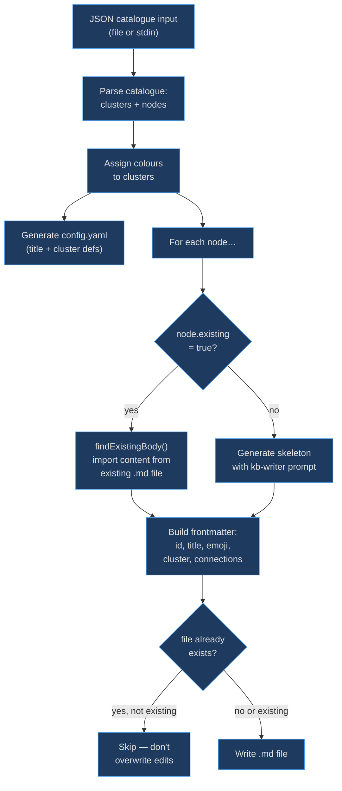
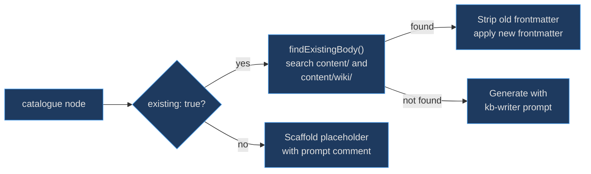

# Catalogue Transformer

The catalogue transformer exists to bridge the gap between the kb-architect agent (which produces a structured JSON catalogue describing a knowledge base's topology) and kbexplorer's content format (individual `.md` files with YAML frontmatter). It automates the creation of `config.yaml` and per-node skeleton files, allowing an AI agent to design a knowledge base structure and a human or another agent to fill in the content.

## At a Glance

| Function | Responsibility | Key File | Source |
|----------|---------------|----------|--------|
| `transformCatalogue` | Generate config.yaml + .md files from catalogue | `scripts/transform-catalogue.js` | [scripts/transform-catalogue.js:113](https://github.com/anokye-labs/kbexplorer/blob/main/scripts/transform-catalogue.js#L113) |
| `inferEmoji` | Map topic keywords to emoji | `scripts/transform-catalogue.js` | [scripts/transform-catalogue.js:65](https://github.com/anokye-labs/kbexplorer/blob/main/scripts/transform-catalogue.js#L65) |
| `findExistingBody` | Import body from existing .md files | `scripts/transform-catalogue.js` | [scripts/transform-catalogue.js:87](https://github.com/anokye-labs/kbexplorer/blob/main/scripts/transform-catalogue.js#L87) |
| CLI entry | Read from file arg or stdin | `scripts/transform-catalogue.js` | [scripts/transform-catalogue.js:203](https://github.com/anokye-labs/kbexplorer/blob/main/scripts/transform-catalogue.js#L203) |

## Transformation Pipeline



<!-- Sources: scripts/transform-catalogue.js:113-199 -->

## Existing vs New Node Handling



<!-- Sources: scripts/transform-catalogue.js:170-184, scripts/transform-catalogue.js:87-109 -->

## inferEmoji

The `inferEmoji` function at [scripts/transform-catalogue.js:65-71](https://github.com/anokye-labs/kbexplorer/blob/main/scripts/transform-catalogue.js#L65) scans the title and cluster name against a `TOPIC_EMOJI_MAP` lookup table:

| Keywords | Emoji | Keywords | Emoji |
|----------|-------|----------|-------|
| architecture, overview | 🏗️ | auth, security | 🔐 |
| data, database, state | 💾 | config, build, deploy, infra | ⚙️ |
| api, network, http | 🔌 | test, testing | 🧪 |
| ui, component, view, frontend | 🎨 | engine, core, logic, performance | ⚡ |
| cli, tool, script | 🔧 | docs, guide, documentation | 📖 |
| graph | 🕸️ | visual, theme | 🎭/🎨 |

Falls back to `📄` if no keyword matches.

## findExistingBody

At [scripts/transform-catalogue.js:87-109](https://github.com/anokye-labs/kbexplorer/blob/main/scripts/transform-catalogue.js#L87), searches for existing content in three locations:

1. `content/{nodeId}.md`
2. `content/wiki/{nodeId}.md`
3. `content/wiki/{nodeId-without-wiki-prefix}.md` (for nodes with `wiki-` prefix)

When found, strips the old YAML frontmatter via regex (`/^---\r?\n[\s\S]*?\r?\n---\r?\n/`) and returns only the body content.

## Skip-if-Exists Guard

For **new** nodes (not `existing: true`), the transformer checks at [scripts/transform-catalogue.js:191-194](https://github.com/anokye-labs/kbexplorer/blob/main/scripts/transform-catalogue.js#L191) whether the file already exists. If so, it skips the write to prevent overwriting manually edited content. For `existing` nodes, the write always proceeds to apply updated frontmatter/connections.

## CLI Usage

The CLI entry point at [scripts/transform-catalogue.js:203-231](https://github.com/anokye-labs/kbexplorer/blob/main/scripts/transform-catalogue.js#L203) accepts two input modes:

```
node scripts/transform-catalogue.js <catalogue.json>           # from file
cat catalogue.json | node scripts/transform-catalogue.js       # from stdin
node scripts/transform-catalogue.js <catalogue.json> <outdir>  # custom output dir
```
