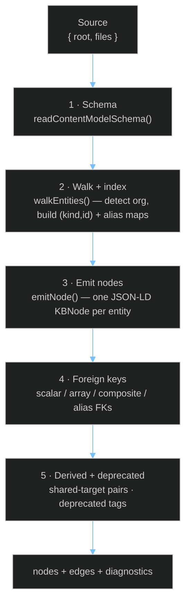

The **content-model ingestion** pipeline turns a *content-model source* — a set of YAML/JSON-LD schema files plus per-entity files — into typed, JSON-LD-backed graph nodes on top of the open [node-type foundation](node-types). It is the F2 layer (issue [#149](https://github.com/anokye-labs/kbexplorer-template/issues/149)) and is implemented as a five-pass builder in `src/engine/content-model/builder.ts`, wrapped as a [provider](providers-overview) in `src/engine/providers/content-model-provider.ts`.

The defining rule: a node's **kind is its `@type`, never its file path**. Paths are opaque hierarchy; the [identity](identity) URN and the JSON-LD `@type` carry all the meaning.

## Safe no-op by default

A content-model source is "present" only when both the identity anchor `teamops.yaml` and the URN context `index/context.jsonld` exist — `hasContentModelSource()` in `src/engine/content-model/schema-reader.ts`. When either is missing, both `buildContentModel()` and the `ContentModelProvider` return empty results, so a repo *without* a content model (like this template) renders byte-identically. This is why the provider can always be registered in the [local loader](local-loader) unconditionally.

## The five passes



Plain-text flow:

```
Source → Schema → Walk+Index → Emit JSON-LD nodes → Resolve FK edges → Derive + deprecate → Graph
```

1. **Schema** — `readContentModelSchema()` parses the five schema files (below) into a typed `ContentModelSchema`.
2. **Walk + index** — `walkEntities()` discovers entity files (skipping schema/index files), parses each, detects its org from disk layout (flat file → default org; nested under `<org>/` → that org), builds the canonical URN, and indexes entries by `(kind, id)` plus an alias index for alias-FK resolution.
3. **Emit nodes** — `emitNode()` produces one JSON-LD `KBNode` per entity: `display: 'entity'`, `entityType: <kind>`, `source: { type: 'structured', entityType, ref }`, `provider: 'content-model'`, and `data` set to the **verbatim** parsed record so the field → node mapping is reversible. The lifecycle band is surfaced on the `jsonld` envelope only, never inside `data`.
4. **Foreign keys** — the `EdgeResolver` resolves the FK rules from `schema/edges.yaml`. Unresolved references become **stub nodes** (`data.unresolved: true`) plus a diagnostic, so a dangling reference never silently drops an edge.
5. **Derived + deprecated** — `shared-target` rules pairwise-link entities that resolve to the same FK target (tagged `relation: 'derived'`); deprecated rules are resolved but tagged `relation: 'deprecated'`.

## Edges ride on `connections`, not `edges`

A subtle but load-bearing detail: the [orchestrator](orchestrator) ignores a provider's returned `edges` array — `buildGraph` derives every rendered edge from each node's `connections`. So the resolver attaches each relationship as a `relation`-tagged `Connection` on the **source node**, and the typed `edges` array is returned only for callers and unit tests. The relations come from the open taxonomy documented in [typed edges](typed-edges) — `leads`, `staffs`, `reports-to`, `structural`, `derived`, `deprecated`.

## URN and CURIE resolution

URN **bases come from the JSON-LD `@context` only** — they are never hardcoded. `buildUrn()` looks up `context.prefixes[kind]` and produces:

- **org-scoped** kinds → `{base}{org}/{id}`
- **authority-scoped** kinds → `{base}{id}`

`resolveCurie()` expands a `prefix:local` CURIE to a URN (already-expanded `scheme://…` values pass through unchanged). The node's `id`, `identity`, and `@id` are all the same URN, and `buildJsonLd()` (in `src/types/index.ts`) writes the reserved keys `@context` / `@id` / `@type` **last** so entity `data` can never override them. This is the same identity contract described in [identity](identity).

## The schema files

`schema-reader.ts` reads exactly five files from the content-model root:

| File | Purpose |
|------|---------|
| `teamops.yaml` | Identity anchor — authority + default (home) org |
| `index/context.jsonld` | CURIE prefix → URN base (the **only** source of URN bases) |
| `schema/conventions.yaml` | Per-kind storage: `path`, `orgScoped`, `aliasField`, `companionExt` |
| `schema/edges.yaml` | FK / derived / deprecated edge rules |
| `schema/lifecycle.yaml` | Kind → lifecycle band |

## Spine node types and viewers

Before emitting, the provider calls `registerContentModelTypes()` (`src/engine/content-model/register.ts`), which registers the seven **spine kinds** and binds each to a bespoke viewer:

| Kind | Viewer | Notes |
|------|--------|-------|
| `person` | PersonView | Leaf of the org graph; `reports-to` relations |
| `squad` | SquadView | `leads` / `staffs` / `structural` / `deprecated` |
| `workstream` | WorkstreamView | Aligned to a priority |
| `mission` | MissionView | Time-boxed, assigned to a cycle + squad |
| `priority` | PriorityView | Ranked organizational priority |
| `cycle` | CycleView | Planning time box |
| `org` | OrgView | Organization with a charter |

Anything without a bespoke viewer falls back to `GenericStructuredView`, so coverage is never zero. The viewer-registry mechanics are covered in [node types](node-types) and from the rendering side in [UI node types](ui-node-types).

## Build wiring

In local mode the source is baked into the manifest at build time:

```
structuredContent.path  →  generate-manifest.js (readContentModel)  →  manifest.contentModel  →  local-loader → ContentModelProvider
```

- `scripts/generate-manifest.js` exposes `readContentModel(root, dirName)`, which walks the repo-relative directory from `structuredContent.path` into a flat `{ root, files }` map (or `null` when the directory is absent/empty). The historical top-level `content-model/` directory remains the default. The result is written as `manifest.contentModel`. See the [manifest generator](manifest-generator) and [build scripts](build-scripts).
- The [local loader](local-loader) always registers `new ContentModelProvider(manifest.contentModel ?? null)`.
- In remote/runtime mode, `GitHubApiSource` resolves the same `structuredContent.path`, fetches that directory through the GitHub API source abstraction, and passes the populated source to `ContentModelProvider`. When the host API cannot fetch the directory, the provider remains a safe no-op.

## The `content-model/` starter directory

A starter `content-model/` directory documents the contract a real source must honour. Its shape mirrors the schema reader's expectations:

```
content-model/
  teamops.yaml            # identity: authority + default org
  index/context.jsonld    # CURIE prefix → URN base
  schema/
    conventions.yaml      # per-kind: path, orgScoped, aliasField, companionExt
    edges.yaml            # FK / derived / deprecated rules
    lifecycle.yaml        # kind → lifecycle band
  people/ada.yaml         # entity files — kind comes from @type, NEVER the path
  squads/<org>/<id>.yaml  # org-scoped kinds may nest under a per-org subdir
  squads/<id>.md          # optional companion markdown merged into the body
```

Drop a directory shaped like this at the repo root, re-run the manifest generator, and the spine renders as typed nodes — with no engine changes, because every kind, viewer, and edge is data-driven. Repos that ship no such directory keep their existing graph untouched.

To keep the directory somewhere else, set:

```yaml
structuredContent:
  path: docs/team-model
```
