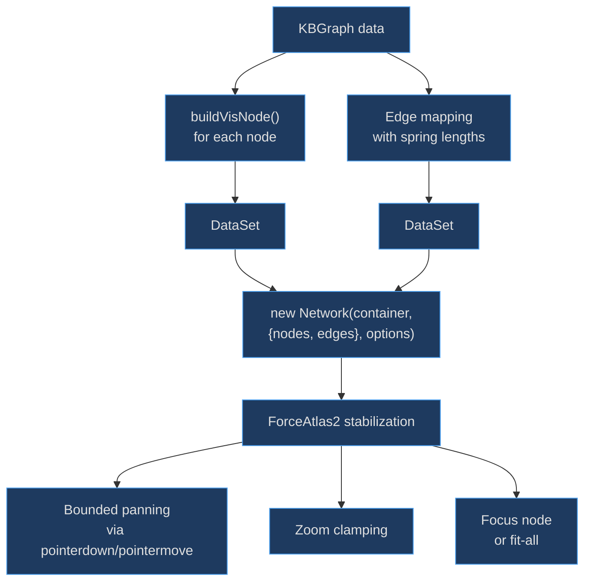
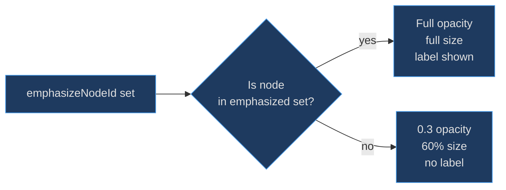

# Graph Network Factory

The graph network factory is the bridge between kbexplorer's abstract `KBGraph` data model and the concrete vis-network rendering engine. It exists because raw vis-network requires extensive boilerplate — node sizing, colour mapping, physics tuning, pan/zoom clamping, custom canvas rendering — and this factory encapsulates all of it behind two clean functions: `createGraphNetwork` (interactive) and `computeGraphPositions` (headless layout computation).

## At a Glance

| Component | Responsibility | Key File | Source |
|-----------|---------------|----------|--------|
| `createGraphNetwork` | Build interactive vis-network instance | `src/engine/createGraphNetwork.ts` | [src/engine/createGraphNetwork.ts:88](https://github.com/anokye-labs/kbexplorer/blob/main/src/engine/createGraphNetwork.ts#L88) |
| `computeGraphPositions` | Headless layout computation | `src/engine/createGraphNetwork.ts` | [src/engine/createGraphNetwork.ts:294](https://github.com/anokye-labs/kbexplorer/blob/main/src/engine/createGraphNetwork.ts#L294) |
| `buildVisNode` | Map KBNode to vis-network node config | `src/engine/createGraphNetwork.ts` | [src/engine/createGraphNetwork.ts:52](https://github.com/anokye-labs/kbexplorer/blob/main/src/engine/createGraphNetwork.ts#L52) |
| `GraphNetworkOptions` | Input configuration interface | `src/engine/createGraphNetwork.ts` | [src/engine/createGraphNetwork.ts:14](https://github.com/anokye-labs/kbexplorer/blob/main/src/engine/createGraphNetwork.ts#L14) |
| `GraphNetworkResult` | Output: network + DataSets | `src/engine/createGraphNetwork.ts` | [src/engine/createGraphNetwork.ts:30](https://github.com/anokye-labs/kbexplorer/blob/main/src/engine/createGraphNetwork.ts#L30) |

## Architecture

<!-- Sources: src/engine/createGraphNetwork.ts:88-287 -->

## Emphasis and Fading

<!-- Sources: src/engine/createGraphNetwork.ts:107-129 -->

## buildVisNode

The `buildVisNode` function at [src/engine/createGraphNetwork.ts:52-85](https://github.com/anokye-labs/kbexplorer/blob/main/src/engine/createGraphNetwork.ts#L52) maps each `KBNode` to a vis-network node config:

| Property | Logic |
|----------|-------|
| **Size** | `baseSize + degree × step`, clamped to `[minSize, maxSize]` |
| **Key node boost** | Nodes in `KEY_NODE_IDS` (`readme`, `overview`, etc.) get 1.5× base and 1.4× max |
| **Colour** | Looked up from `clusterColorMap` |
| **Label** | Title truncated to `labelMaxLength` (default 25), hidden when faded |
| **Shape** | Always `'custom'` — delegates to `createNodeRenderer` for canvas drawing |
| **Disconnected badge** | Nodes with 0 connections get a `⚠ Disconnected node` tooltip |

## Physics Configuration

The vis-network uses ForceAtlas2 physics configured at [src/engine/createGraphNetwork.ts:155-163](https://github.com/anokye-labs/kbexplorer/blob/main/src/engine/createGraphNetwork.ts#L155):

| Parameter | Value | Purpose |
|-----------|-------|---------|
| `gravitationalConstant` | `-120` | Repulsion force between nodes |
| `centralGravity` | `0.01` | Pull toward graph center |
| `springLength` | `200` | Base edge rest length |
| `springConstant` | `0.04` | Edge elasticity |
| `damping` | `0.6` | Velocity damping factor |
| `stabilization.iterations` | `150` | Steps before stabilized event fires |

Edge `length` is computed as `baseSpringLength / weight` (line 140) so higher-weight edges pull nodes closer together.

## Bounded Panning

Vis-network's built-in `dragView` is disabled. After stabilization, custom pointer event handlers at [src/engine/createGraphNetwork.ts:219-253](https://github.com/anokye-labs/kbexplorer/blob/main/src/engine/createGraphNetwork.ts#L219) implement bounded panning:

1. `pointerdown` on empty canvas area → capture start position
2. `pointermove` → compute delta, apply `clamp()` to keep view within graph bounds + 120px padding
3. `pointerup` / `pointercancel` → end pan

The `clamp()` function at [src/engine/createGraphNetwork.ts:206-216](https://github.com/anokye-labs/kbexplorer/blob/main/src/engine/createGraphNetwork.ts#L206) ensures users can never scroll the graph entirely off-screen.

## Zoom Clamping

On every `zoom` event at [src/engine/createGraphNetwork.ts:256-263](https://github.com/anokye-labs/kbexplorer/blob/main/src/engine/createGraphNetwork.ts#L256), the view position is re-clamped to the graph bounds. This prevents the zoom-then-pan exploit that would otherwise let users escape the bounded area.

## computeGraphPositions

The `computeGraphPositions` function at [src/engine/createGraphNetwork.ts:294-354](https://github.com/anokye-labs/kbexplorer/blob/main/src/engine/createGraphNetwork.ts#L294) creates a hidden off-screen vis-network (400×280px, positioned at `left: -9999px`) purely for layout computation. Once stabilized, it extracts node positions into a `Map<string, {x, y}>`, calls the `onComplete` callback, then destroys itself. Returns a cleanup function for React effect teardown.
