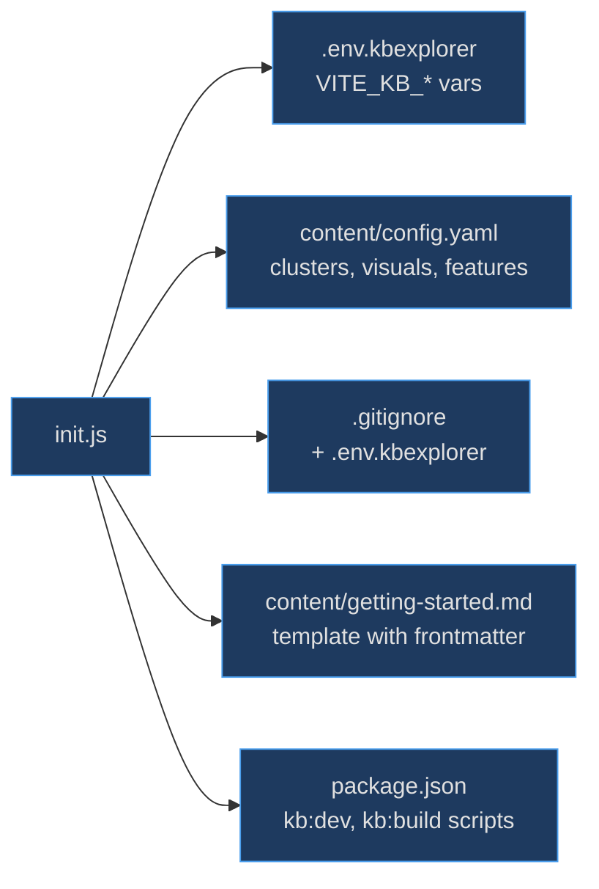

# Interactive Init Script

The init script exists so that setting up kbexplorer in a new repository requires zero manual configuration. Instead of asking users to hand-edit `.env` files, create `config.yaml`, and wire up npm scripts, this interactive wizard asks a few questions and generates everything — making the onboarding experience a single `node scripts/init.js` invocation.

## At a Glance

| Function | Responsibility | Key File | Source |
|----------|---------------|----------|--------|
| `main` | Orchestrate the full setup wizard | `scripts/init.js` | [scripts/init.js:274](https://github.com/anokye-labs/kbexplorer/blob/main/scripts/init.js#L274) |
| `createPrompt` | readline-based `ask`, `choose`, `confirm` helpers | `scripts/init.js` | [scripts/init.js:29](https://github.com/anokye-labs/kbexplorer/blob/main/scripts/init.js#L29) |
| `detectGitRemote` | Parse SSH/HTTPS GitHub remote URLs | `scripts/init.js` | [scripts/init.js:62](https://github.com/anokye-labs/kbexplorer/blob/main/scripts/init.js#L62) |
| `isSelfHosted` | Detect kbexplorer repo vs submodule | `scripts/init.js` | [scripts/init.js:93](https://github.com/anokye-labs/kbexplorer/blob/main/scripts/init.js#L93) |
| `writeEnvFile` | Generate `.env.kbexplorer` | `scripts/init.js` | [scripts/init.js:107](https://github.com/anokye-labs/kbexplorer/blob/main/scripts/init.js#L107) |
| `writeConfigYaml` | Generate `content/config.yaml` | `scripts/init.js` | [scripts/init.js:123](https://github.com/anokye-labs/kbexplorer/blob/main/scripts/init.js#L123) |
| `addNpmScripts` | Inject `kb:dev`, `kb:build` into package.json | `scripts/init.js` | [scripts/init.js:183](https://github.com/anokye-labs/kbexplorer/blob/main/scripts/init.js#L183) |
| `scaffoldStarterContent` | Create getting-started.md template | `scripts/init.js` | [scripts/init.js:228](https://github.com/anokye-labs/kbexplorer/blob/main/scripts/init.js#L228) |

## Setup Wizard Flow

```mermaid
flowchart TD
    A["init.js starts"] --> B["isSelfHosted()\ndetect mode"]
    B --> C["detectGitRemote()\ndetectBranch()"]
    C --> D["Interactive prompts:\nowner, repo, branch,\ntitle, subtitle, author"]
    D --> E["Choose content mode:\nrepo-aware / authored / both"]
    E --> F["Choose visual mode:\nemoji / sprites / heroes / none"]
    F --> G["Choose theme:\ndark / light / sepia"]
    G --> H["Feature toggles:\nHUD, minimap, reading tools,\nkeyboard nav"]
    H --> I["writeEnvFile()"]
    I --> J["writeConfigYaml()"]
    J --> K["updateGitignore()"]
    K --> L{"content path\nchosen?"}
    L -->|yes| M["scaffoldStarterContent()"]
    L -->|no| N["skip"]
    M --> O["addNpmScripts()"]
    N --> O
    O --> P{"submodule?"}
    P -->|yes| Q["installDependencies()"]
    P -->|no| R["done"]

    style A fill:#1e3a5f,stroke:#4a9eed,color:#e0e0e0
    style B fill:#1e3a5f,stroke:#4a9eed,color:#e0e0e0
    style C fill:#1e3a5f,stroke:#4a9eed,color:#e0e0e0
    style D fill:#1e3a5f,stroke:#4a9eed,color:#e0e0e0
    style E fill:#1e3a5f,stroke:#4a9eed,color:#e0e0e0
    style F fill:#1e3a5f,stroke:#4a9eed,color:#e0e0e0
    style G fill:#1e3a5f,stroke:#4a9eed,color:#e0e0e0
    style H fill:#1e3a5f,stroke:#4a9eed,color:#e0e0e0
    style I fill:#1e3a5f,stroke:#4a9eed,color:#e0e0e0
    style J fill:#1e3a5f,stroke:#4a9eed,color:#e0e0e0
    style K fill:#1e3a5f,stroke:#4a9eed,color:#e0e0e0
    style L fill:#1e3a5f,stroke:#4a9eed,color:#e0e0e0
    style M fill:#1e3a5f,stroke:#4a9eed,color:#e0e0e0
    style N fill:#1e3a5f,stroke:#4a9eed,color:#e0e0e0
    style O fill:#1e3a5f,stroke:#4a9eed,color:#e0e0e0
    style P fill:#1e3a5f,stroke:#4a9eed,color:#e0e0e0
    style Q fill:#1e3a5f,stroke:#4a9eed,color:#e0e0e0
    style R fill:#1e3a5f,stroke:#4a9eed,color:#e0e0e0
```

<!-- Sources: scripts/init.js:274-398 -->

## Generated Artifacts

<!-- Sources: scripts/init.js:107-257 -->

## createPrompt Helpers

The prompt system at [scripts/init.js:29-59](https://github.com/anokye-labs/kbexplorer/blob/main/scripts/init.js#L29) uses `readline.createInterface` with three methods:

| Method | Usage | Details |
|--------|-------|---------|
| `ask(question, default?)` | Free-text input | Returns default if empty |
| `choose(question, options[], defaultIndex)` | Numbered list selection | Displays `→` marker on default |
| `confirm(question, defaultYes?)` | Y/n boolean | Parses `y`/`n` with configurable default |

## detectGitRemote

At [scripts/init.js:62-79](https://github.com/anokye-labs/kbexplorer/blob/main/scripts/init.js#L62), this function runs `git remote get-url origin` and parses two URL formats:

| Format | Regex | Example |
|--------|-------|---------|
| SSH | `git@[^:]+:([^/]+)/([^/.]+)` | `git@github.com:org/repo.git` |
| HTTPS | `github.com/([^/]+)/([^/.]+)` | `https://github.com/org/repo.git` |

Returns `{ owner, repo }` or `null` if detection fails.

## isSelfHosted

At [scripts/init.js:93-105](https://github.com/anokye-labs/kbexplorer/blob/main/scripts/init.js#L93), detects self-hosted mode via three checks:
1. Host `package.json` name is `'kbexplorer'`
2. Git remote repo name is `'kbexplorer'`
3. `kbRoot === hostRoot` (not a submodule)

## writeEnvFile

Generates `.env.kbexplorer` at [scripts/init.js:107-121](https://github.com/anokye-labs/kbexplorer/blob/main/scripts/init.js#L107) with `VITE_KB_OWNER`, `VITE_KB_REPO`, `VITE_KB_BRANCH`, `VITE_KB_TITLE`, and optionally `VITE_KB_PATH`.

## addNpmScripts

At [scripts/init.js:183-212](https://github.com/anokye-labs/kbexplorer/blob/main/scripts/init.js#L183), injects scripts into the host's `package.json`:

| Mode | `kb:dev` | `kb:build` |
|------|----------|------------|
| Self-hosted | `vite --open` | `tsc -b && vite build` |
| Submodule | `node .kbexplorer/scripts/dev.js` | `node .kbexplorer/scripts/build.js` |

Also adds `kb:install` in submodule mode for dependency management.
