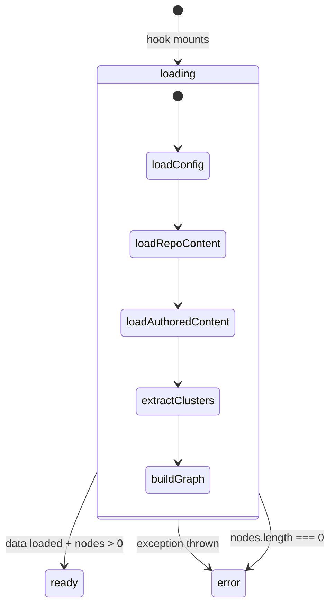
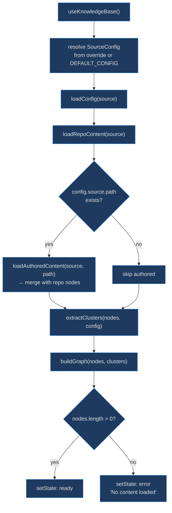

# Knowledge Base Loader

The `useKnowledgeBase` hook is the single point of truth for data loading in kbexplorer. Every React component that needs the knowledge graph receives it from this hook — it encapsulates the entire fetch → parse → build pipeline behind a three-state discriminated union (`loading | ready | error`), so the rest of the UI only needs to pattern-match on status.

## At a Glance

| Component | Responsibility | Key File | Source |
|-----------|---------------|----------|--------|
| `useKnowledgeBase` | Load and assemble the knowledge graph | `src/hooks/useKnowledgeBase.ts` | [src/hooks/useKnowledgeBase.ts:21](https://github.com/anokye-labs/kbexplorer/blob/main/src/hooks/useKnowledgeBase.ts#L21) |
| `LoadingState` | Discriminated union type | `src/hooks/useKnowledgeBase.ts` | [src/hooks/useKnowledgeBase.ts:12](https://github.com/anokye-labs/kbexplorer/blob/main/src/hooks/useKnowledgeBase.ts#L12) |
| `DEFAULT_CONFIG` | Fallback config from env vars | `src/types/index.ts` | [src/types/index.ts:137](https://github.com/anokye-labs/kbexplorer/blob/main/src/types/index.ts#L137) |

## Loading State Machine

<!-- Sources: src/hooks/useKnowledgeBase.ts:12-16, src/hooks/useKnowledgeBase.ts:27-67 -->

## Loading Pipeline

<!-- Sources: src/hooks/useKnowledgeBase.ts:27-66 -->

## LoadingState Union

The discriminated union at [src/hooks/useKnowledgeBase.ts:12-15](https://github.com/anokye-labs/kbexplorer/blob/main/src/hooks/useKnowledgeBase.ts#L12) ensures consumers handle all states:

| Status | Payload | When |
|--------|---------|------|
| `loading` | none | Initial state and during async load |
| `ready` | `{ graph: KBGraph, config: KBConfig }` | Data loaded successfully with ≥1 node |
| `error` | `{ error: string }` | Fetch failed or zero nodes returned |

## Remote Mode Pipeline

When not in local mode, the hook runs a five-step pipeline at [src/hooks/useKnowledgeBase.ts:30-47](https://github.com/anokye-labs/kbexplorer/blob/main/src/hooks/useKnowledgeBase.ts#L30):

1. **`loadConfig(source)`** — fetch and parse `config.yaml` from the repo
2. **`loadRepoContent(source)`** — fetch issues, tree, README via GitHub API
3. **`loadAuthoredContent(source, path)`** — fetch authored markdown files (if `config.source.path` exists; failures are silently ignored)
4. **`extractClusters(nodes, config)`** — merge config-defined and auto-detected clusters
5. **`buildGraph(nodes, clusters)`** — produce the final `KBGraph`

## Cancellation Guard

A `cancelled` boolean flag is set via the `useEffect` cleanup at [src/hooks/useKnowledgeBase.ts:70](https://github.com/anokye-labs/kbexplorer/blob/main/src/hooks/useKnowledgeBase.ts#L70). Before every `setState` call, the async function checks `if (!cancelled)` to prevent state updates after the component unmounts — critical for React Strict Mode where effects fire twice.

## Error Handling

Two error scenarios are handled:

| Scenario | Detection | Message |
|----------|-----------|---------|
| Exception | `catch` block at line 59 | Raw error message from the exception |
| Empty content | `nodes.length === 0` check at line 50 | `'No content loaded. The GitHub API may be rate-limited…'` |

The empty-content check specifically addresses GitHub API rate limiting, where requests succeed with 200 status but return empty arrays when the rate limit is exhausted.
