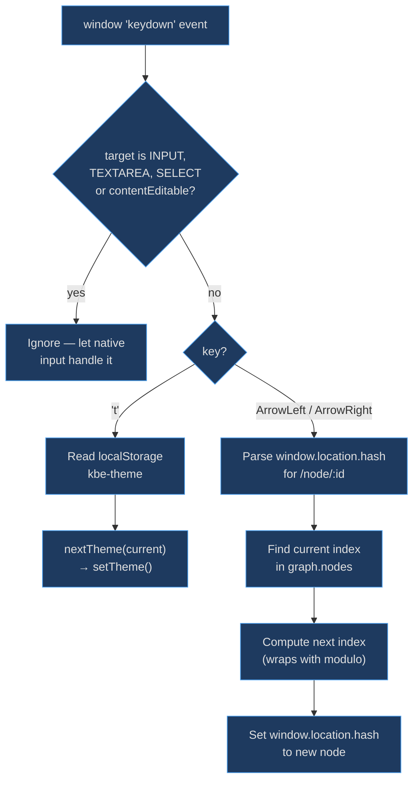
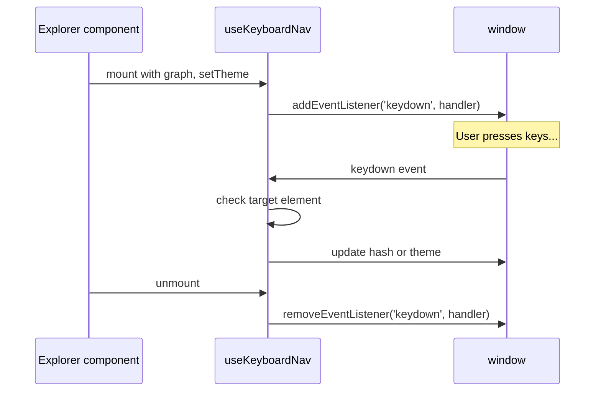

# Keyboard Navigation

Keyboard navigation exists so power users can browse the knowledge base without touching a mouse. It keeps the interaction model simple — just three keys — while respecting editable elements to avoid conflicts with text input.

## At a Glance

| Component | Responsibility | Key File | Source |
|-----------|---------------|----------|--------|
| `useKeyboardNav` | Global keydown listener hook | `src/hooks/useKeyboardNav.ts` | [src/hooks/useKeyboardNav.ts:11](https://github.com/anokye-labs/kbexplorer/blob/main/src/hooks/useKeyboardNav.ts#L11) |
| `nextTheme` | Cycle through theme modes | `src/hooks/useTheme.ts` | imported at line 3 |

## Key Bindings

| Key | Action | Source |
|-----|--------|--------|
| `t` | Cycle theme: dark → light → sepia → dark | [src/hooks/useKeyboardNav.ts:22-26](https://github.com/anokye-labs/kbexplorer/blob/main/src/hooks/useKeyboardNav.ts#L22) |
| `←` (ArrowLeft) | Navigate to previous node | [src/hooks/useKeyboardNav.ts:28-41](https://github.com/anokye-labs/kbexplorer/blob/main/src/hooks/useKeyboardNav.ts#L28) |
| `→` (ArrowRight) | Navigate to next node | [src/hooks/useKeyboardNav.ts:28-41](https://github.com/anokye-labs/kbexplorer/blob/main/src/hooks/useKeyboardNav.ts#L28) |

## Event Flow

<!-- Sources: src/hooks/useKeyboardNav.ts:16-42 -->

## Hook Lifecycle

<!-- Sources: src/hooks/useKeyboardNav.ts:46-48 -->

## Input Element Guard

The handler at [src/hooks/useKeyboardNav.ts:17-19](https://github.com/anokye-labs/kbexplorer/blob/main/src/hooks/useKeyboardNav.ts#L17) checks the event target's `tagName` against `INPUT`, `TEXTAREA`, and `SELECT`, plus the `isContentEditable` property. This prevents keyboard shortcuts from hijacking text entry in HUD search boxes or any future form elements.

## Arrow Navigation

Node cycling at [src/hooks/useKeyboardNav.ts:28-41](https://github.com/anokye-labs/kbexplorer/blob/main/src/hooks/useKeyboardNav.ts#L28) parses the current node ID from `window.location.hash`, finds its index in `graph.nodes`, then computes the next index using modular arithmetic — `ArrowRight` adds 1, `ArrowLeft` subtracts 1, both wrapping around the array boundaries. If the graph is `null` or the hash doesn't match the `/node/:id` pattern, the handler is a no-op.

## Cleanup

The `useEffect` returns a cleanup function at [src/hooks/useKeyboardNav.ts:47](https://github.com/anokye-labs/kbexplorer/blob/main/src/hooks/useKeyboardNav.ts#L47) that removes the event listener, ensuring no dangling handlers survive component unmount. The effect depends on `[graph, setTheme]` so the handler is rebuilt if either changes.
