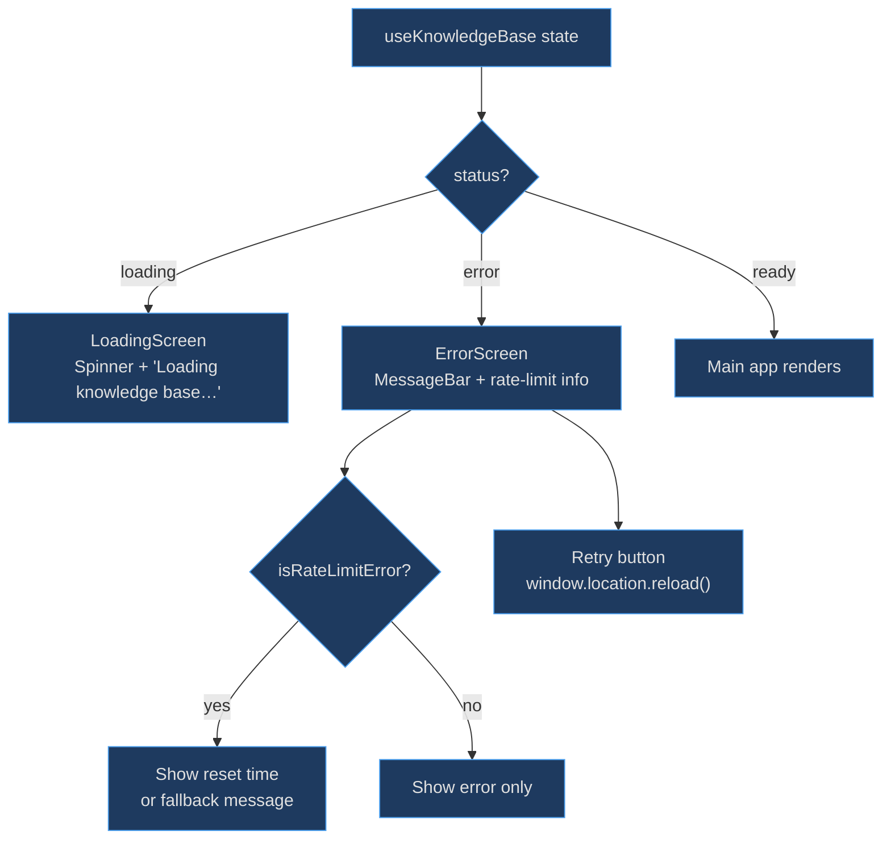
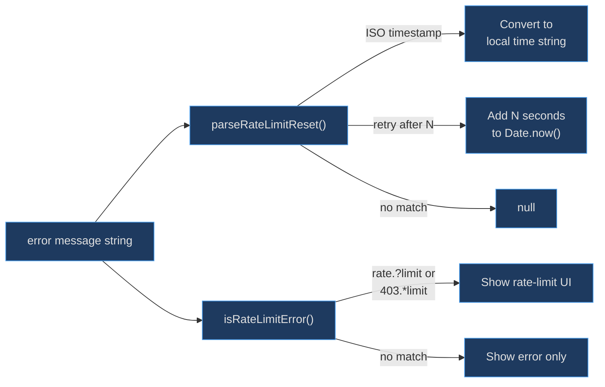

# Loading & Error Screens

These screens exist because the knowledge base requires async data fetching before anything useful can render. Users need clear feedback during the loading period and actionable guidance when things go wrong — especially GitHub API rate limiting, the single most common failure mode.

## At a Glance

| Component | Responsibility | Key File | Source |
|-----------|---------------|----------|--------|
| `LoadingScreen` | Centered spinner during data load | `src/components/LoadingScreen.tsx` | [src/components/LoadingScreen.tsx:14](https://github.com/anokye-labs/kbexplorer/blob/main/src/components/LoadingScreen.tsx#L14) |
| `ErrorScreen` | Error display with rate-limit detection + retry | `src/components/ErrorScreen.tsx` | [src/components/ErrorScreen.tsx:51](https://github.com/anokye-labs/kbexplorer/blob/main/src/components/ErrorScreen.tsx#L51) |
| `parseRateLimitReset` | Extract reset time from error messages | `src/components/ErrorScreen.tsx` | [src/components/ErrorScreen.tsx:15](https://github.com/anokye-labs/kbexplorer/blob/main/src/components/ErrorScreen.tsx#L15) |
| `isRateLimitError` | Detect rate-limit errors via regex | `src/components/ErrorScreen.tsx` | [src/components/ErrorScreen.tsx:28](https://github.com/anokye-labs/kbexplorer/blob/main/src/components/ErrorScreen.tsx#L28) |

## Screen Selection Flow

<!-- Sources: src/App.tsx:44-45, src/components/ErrorScreen.tsx:51-76 -->

## Error Handling Pipeline

<!-- Sources: src/components/ErrorScreen.tsx:15-30 -->

## LoadingScreen

A minimal full-viewport component at [src/components/LoadingScreen.tsx:14-22](https://github.com/anokye-labs/kbexplorer/blob/main/src/components/LoadingScreen.tsx#L14):

| Element | Fluent Component | Details |
|---------|-----------------|---------|
| Spinner | `Spinner size="large"` | Animated loading indicator |
| Message | `Body1` | Static text: "Loading knowledge base…" |
| Layout | `makeStyles` with `height: 100vh` | Centered flex column with `spacingVerticalXL` gap |

## ErrorScreen

A richer component at [src/components/ErrorScreen.tsx:51-76](https://github.com/anokye-labs/kbexplorer/blob/main/src/components/ErrorScreen.tsx#L51) with three zones:

| Zone | Component | Condition |
|------|-----------|-----------|
| Error message | `MessageBar intent="error"` | Always shown |
| Rate-limit info | `Caption1` | Only when `isRateLimitError(message)` is true |
| Retry button | `Button appearance="primary"` | Always shown, calls `window.location.reload()` |

## Rate-Limit Detection

The `parseRateLimitReset` function at [src/components/ErrorScreen.tsx:15-26](https://github.com/anokye-labs/kbexplorer/blob/main/src/components/ErrorScreen.tsx#L15) uses two regex patterns:

1. **ISO timestamp pattern**: `/rate limit.*?reset.*?(\d{4}-\d{2}-\d{2}[T ]\d{2}:\d{2})/i`
2. **Retry-after seconds**: `/retry after (\d+)/i`

When a match is found, the function converts the extracted value to a local time string via `toLocaleTimeString()`. The `isRateLimitError` function at [src/components/ErrorScreen.tsx:28-30](https://github.com/anokye-labs/kbexplorer/blob/main/src/components/ErrorScreen.tsx#L28) performs a broader check with `/rate.?limit/i` or `/403.*limit/i` to decide whether to show the rate-limit UI at all.
