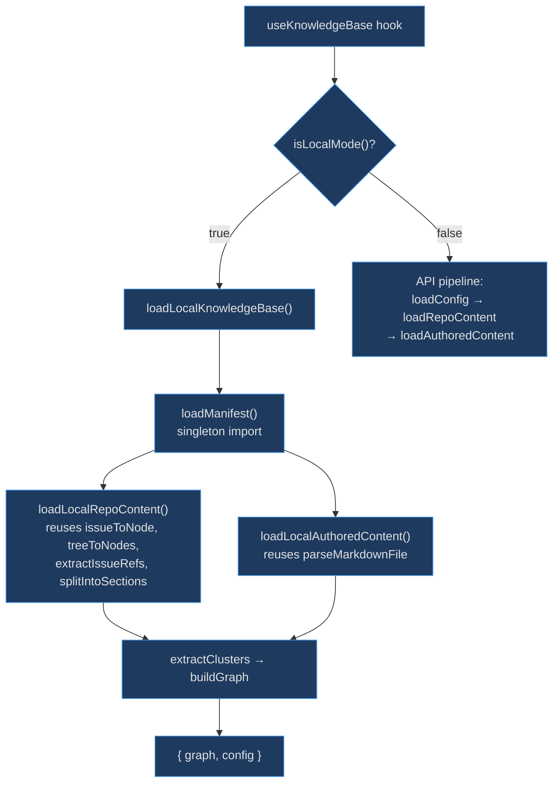
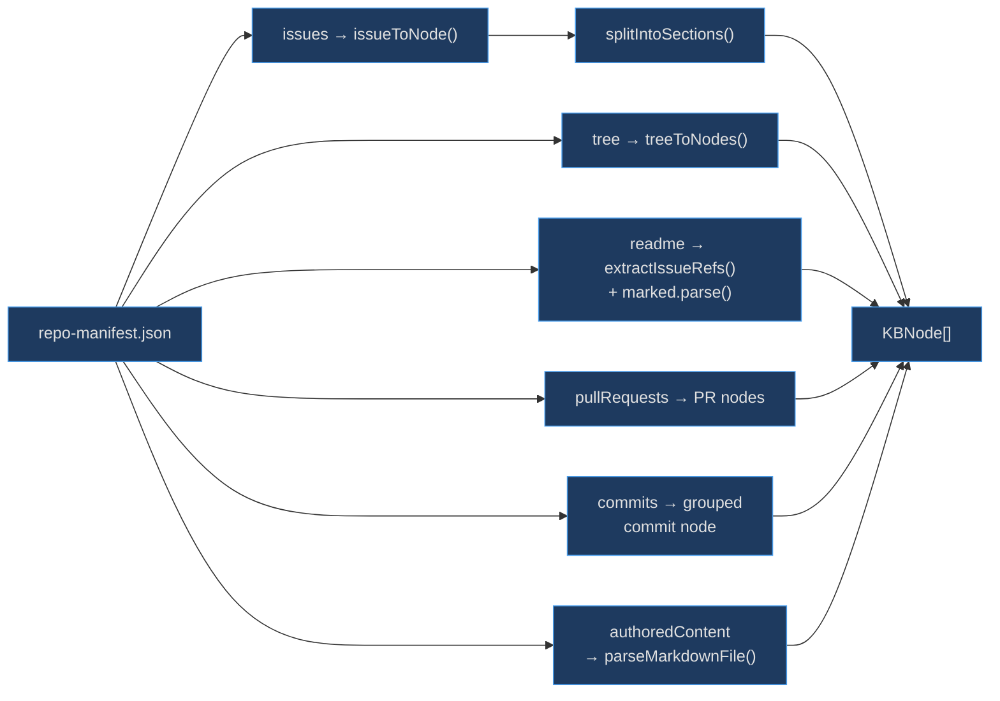

# Local Mode Loader

The local loader exists to enable zero-API-call operation. Instead of fetching issues, PRs, and file trees from GitHub at runtime, it reads everything from a pre-built `repo-manifest.json` file that the manifest generator produces at build time. This eliminates rate-limit concerns, allows fully offline usage, and dramatically accelerates load times — while reusing the exact same parser functions as the API path to guarantee consistent output.

## At a Glance

| Component | Responsibility | Key File | Source |
|-----------|---------------|----------|--------|
| `isLocalMode` | Check `VITE_KB_LOCAL` env var | `src/engine/local-loader.ts` | [src/engine/local-loader.ts:68](https://github.com/anokye-labs/kbexplorer/blob/main/src/engine/local-loader.ts#L68) |
| `loadManifest` | Singleton lazy import of manifest JSON | `src/engine/local-loader.ts` | [src/engine/local-loader.ts:52](https://github.com/anokye-labs/kbexplorer/blob/main/src/engine/local-loader.ts#L52) |
| `loadLocalAuthoredContent` | Parse `.md` files from manifest | `src/engine/local-loader.ts` | [src/engine/local-loader.ts:93](https://github.com/anokye-labs/kbexplorer/blob/main/src/engine/local-loader.ts#L93) |
| `loadLocalRepoContent` | Transform issues/tree/README/PRs/commits | `src/engine/local-loader.ts` | [src/engine/local-loader.ts:110](https://github.com/anokye-labs/kbexplorer/blob/main/src/engine/local-loader.ts#L110) |
| `loadLocalKnowledgeBase` | Full orchestration entry point | `src/engine/local-loader.ts` | [src/engine/local-loader.ts:242](https://github.com/anokye-labs/kbexplorer/blob/main/src/engine/local-loader.ts#L242) |
| `RepoManifest` | Shape of pre-built JSON | `src/engine/local-loader.ts` | [src/engine/local-loader.ts:24](https://github.com/anokye-labs/kbexplorer/blob/main/src/engine/local-loader.ts#L24) |

## Local vs API Loading

<!-- Sources: src/engine/local-loader.ts:68-70, src/engine/local-loader.ts:242-253 -->

## Manifest Content Pipeline

<!-- Sources: src/engine/local-loader.ts:110-237 -->

## RepoManifest Interface

The manifest shape at [src/engine/local-loader.ts:24-46](https://github.com/anokye-labs/kbexplorer/blob/main/src/engine/local-loader.ts#L24) mirrors the data the API path fetches at runtime:

| Field | Type | Description |
|-------|------|-------------|
| `configRaw` | `string \| null` | Raw `config.yaml` content |
| `authoredContent` | `Record<string, string>` | Markdown files keyed by path |
| `tree` | `Array<{path, type, size?}>` | File system tree (GHTreeItem-compatible) |
| `readme` | `string \| null` | README.md content |
| `issues` | `GHIssue[]` | GitHub issues from `gh` CLI |
| `pullRequests` | `Array<{number, title, body, state, ...}>` | Pull request data |
| `commits` | `Array<{sha, commit, html_url}>` | Recent git commits |
| `generatedAt` | `string` | ISO timestamp of manifest generation |

## Singleton Manifest Loading

The `loadManifest()` function at [src/engine/local-loader.ts:52-63](https://github.com/anokye-labs/kbexplorer/blob/main/src/engine/local-loader.ts#L52) uses a module-level `_manifestPromise` to ensure the dynamic `import()` of `repo-manifest.json` only fires once, regardless of how many callers request the manifest concurrently.

## Mode Detection

`isLocalMode()` at [src/engine/local-loader.ts:68](https://github.com/anokye-labs/kbexplorer/blob/main/src/engine/local-loader.ts#L68) checks `import.meta.env.VITE_KB_LOCAL === 'true'`. This must be an explicit opt-in; without it, the app always uses the API path.

## Repo Content Processing

`loadLocalRepoContent()` at [src/engine/local-loader.ts:110-237](https://github.com/anokye-labs/kbexplorer/blob/main/src/engine/local-loader.ts#L110) mirrors the API-based `loadRepoContent()` but reads from the manifest. Key steps:

1. **Issues** → `issueToNode()` for each `manifest.issues` entry (line 119)
2. **Tree** → `treeToNodes()` for the file tree (lines 122-123)
3. **README** → `extractIssueRefs()` + fuzzy title matching + directory matching to build connections, then `marked.parse()` for HTML (lines 128-165)
4. **Auto-link** → issues referencing directory names get cross-connections (lines 168-181)
5. **Section split** → issues with 2+ headings are expanded into parent + section nodes via `splitIntoSections()` (lines 183-195)
6. **PRs** → each pull request becomes a node in the `pull-request` cluster with `extractIssueRefs` connections (lines 198-215)
7. **Commits** → grouped into a single "Recent Commits" node with a markdown list of the last 30 commits (lines 218-235)
