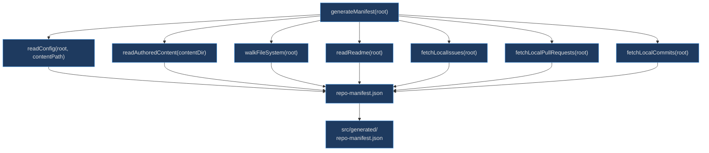
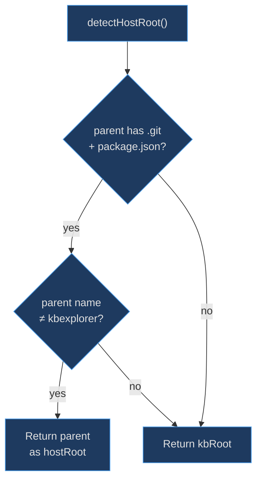

# Manifest Generator

The manifest generator exists to snapshot the host repository into a single JSON file at build time, so the local-mode loader can produce the exact same knowledge graph as the API path — but without any runtime GitHub API calls. This is critical for offline usage, CI/CD preview deployments, and avoiding rate-limit issues during development.

## At a Glance

| Function | Responsibility | Key File | Source |
|----------|---------------|----------|--------|
| `generateManifest` | Orchestrate all readers and write JSON | `scripts/generate-manifest.js` | [scripts/generate-manifest.js:286](https://github.com/anokye-labs/kbexplorer/blob/main/scripts/generate-manifest.js#L286) |
| `walkFileSystem` | Recursive FS walker producing GHTreeItem entries | `scripts/generate-manifest.js` | [scripts/generate-manifest.js:67](https://github.com/anokye-labs/kbexplorer/blob/main/scripts/generate-manifest.js#L67) |
| `readAuthoredContent` | Read all `.md` files from content directory | `scripts/generate-manifest.js` | [scripts/generate-manifest.js:107](https://github.com/anokye-labs/kbexplorer/blob/main/scripts/generate-manifest.js#L107) |
| `readConfig` | Locate and read config.yaml | `scripts/generate-manifest.js` | [scripts/generate-manifest.js:140](https://github.com/anokye-labs/kbexplorer/blob/main/scripts/generate-manifest.js#L140) |
| `fetchLocalIssues` | Fetch issues via `gh` CLI | `scripts/generate-manifest.js` | [scripts/generate-manifest.js:188](https://github.com/anokye-labs/kbexplorer/blob/main/scripts/generate-manifest.js#L188) |
| `fetchLocalPullRequests` | Fetch PRs via `gh` CLI | `scripts/generate-manifest.js` | [scripts/generate-manifest.js:226](https://github.com/anokye-labs/kbexplorer/blob/main/scripts/generate-manifest.js#L226) |
| `fetchLocalCommits` | Parse `git log` output | `scripts/generate-manifest.js` | [scripts/generate-manifest.js:260](https://github.com/anokye-labs/kbexplorer/blob/main/scripts/generate-manifest.js#L260) |
| `detectHostRoot` | Detect submodule vs standalone mode | `scripts/generate-manifest.js` | [scripts/generate-manifest.js:33](https://github.com/anokye-labs/kbexplorer/blob/main/scripts/generate-manifest.js#L33) |

## Generation Pipeline

<!-- Sources: scripts/generate-manifest.js:286-315 -->

## Submodule Detection

<!-- Sources: scripts/generate-manifest.js:33-46 -->

## walkFileSystem

The recursive directory walker at [scripts/generate-manifest.js:67-97](https://github.com/anokye-labs/kbexplorer/blob/main/scripts/generate-manifest.js#L67) produces entries compatible with the GitHub API's `GHTreeItem` shape:

| Rule | Details |
|------|---------|
| **Skipped directories** | `node_modules`, `.git`, `dist`, `.kbexplorer`, `.astro`, `.vscode`, `.idea`, `coverage` |
| **Skipped files** | `package-lock.json`, `.DS_Store`, `Thumbs.db` |
| **Hidden files** | Skipped (`.` prefix), except `.github` |
| **Entries** | `{ path, type: 'blob'|'tree', size? }` — size from `statSync` |

## readAuthoredContent

At [scripts/generate-manifest.js:107-130](https://github.com/anokye-labs/kbexplorer/blob/main/scripts/generate-manifest.js#L107), this function recursively reads all `.md` files from the content directory, returning a `Record<string, string>` keyed by relative path (e.g., `content/overview.md` → raw markdown string).

## readConfig

The config reader at [scripts/generate-manifest.js:140-154](https://github.com/anokye-labs/kbexplorer/blob/main/scripts/generate-manifest.js#L140) searches three locations in order:

1. `{root}/{contentPath}/config.yaml`
2. `{root}/{contentPath}/config.yml`
3. `{root}/config.yaml`

Returns the raw YAML string or `null`.

## GitHub Data Fetching

Issues and PRs are fetched via the `gh` CLI (if available) with a 30-second timeout:

| Function | Command | Limit | Source |
|----------|---------|-------|--------|
| `fetchLocalIssues` | `gh issue list --json ... --state all` | 200 | [line 188](https://github.com/anokye-labs/kbexplorer/blob/main/scripts/generate-manifest.js#L188) |
| `fetchLocalPullRequests` | `gh pr list --json ... --state all` | 200 | [line 226](https://github.com/anokye-labs/kbexplorer/blob/main/scripts/generate-manifest.js#L226) |
| `fetchLocalCommits` | `git log --pretty=format:"%H\|\|\|%s\|\|\|%an\|\|\|%aI" -50` | 50 | [line 260](https://github.com/anokye-labs/kbexplorer/blob/main/scripts/generate-manifest.js#L260) |

All three are best-effort — failures are logged as warnings and return empty arrays, so the manifest still generates even without `gh` CLI or in repos without remotes.

## Output

The assembled manifest is written to `src/generated/repo-manifest.json` at [scripts/generate-manifest.js:305-306](https://github.com/anokye-labs/kbexplorer/blob/main/scripts/generate-manifest.js#L305) and includes a `generatedAt` ISO timestamp. A summary of entry counts is logged to stdout.
