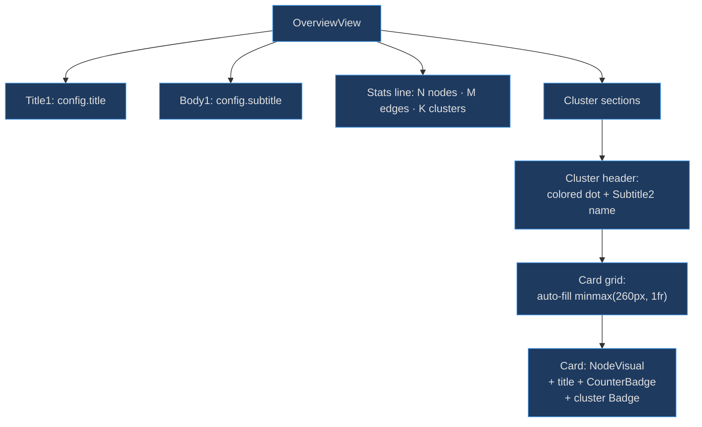
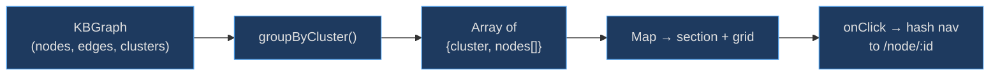

# Overview View

The Overview View exists to give users a bird's-eye snapshot of the entire knowledge base before they dive into individual nodes. Working with the [`KBGraph` and `KBConfig`](type-system) data structures, it groups every node by cluster, renders each with a [`NodeVisual`](visual-system) identity, shows aggregate statistics, and provides one-click navigation into any node — acting as a table of contents for the graph.

## At a Glance

| Component | Responsibility | Key File | Source |
|-----------|---------------|----------|--------|
| `OverviewView` | Render the full knowledge base grid | `src/views/OverviewView.tsx` | [src/views/OverviewView.tsx:116](https://github.com/anokye-labs/kbexplorer/blob/main/src/views/OverviewView.tsx#L116) |
| `groupByCluster` | Group nodes by cluster in cluster-order | `src/views/OverviewView.tsx` | [src/views/OverviewView.tsx:23](https://github.com/anokye-labs/kbexplorer/blob/main/src/views/OverviewView.tsx#L23) |
| `NodeVisual` | Render emoji / sprite / image for each card | `src/components/NodeVisual.tsx` | imported at line 15 |

## Layout Architecture



<!-- Sources: src/views/OverviewView.tsx:116-191 -->

## Data Flow



<!-- Sources: src/views/OverviewView.tsx:23-36, src/views/OverviewView.tsx:146-148 -->

## groupByCluster Function

The `groupByCluster` function at [src/views/OverviewView.tsx:23-36](https://github.com/anokye-labs/kbexplorer/blob/main/src/views/OverviewView.tsx#L23) builds a `Map<string, KBNode[]>` from all nodes, then iterates the `clusters` array (which is pre-ordered) and emits only clusters that have at least one node. This ensures the rendered order matches the cluster definition order, not the arbitrary order nodes appear in data.

## Statistics Line

A `Caption1` element at [src/views/OverviewView.tsx:126-128](https://github.com/anokye-labs/kbexplorer/blob/main/src/views/OverviewView.tsx#L126) renders a single-line summary:

```
N nodes · M edges · K clusters
```

This gives users immediate scale awareness without needing to scroll through the entire page.

## Cluster Sections

Each cluster section at [src/views/OverviewView.tsx:131-138](https://github.com/anokye-labs/kbexplorer/blob/main/src/views/OverviewView.tsx#L131) renders:

| Element | Description |
|---------|-------------|
| Colored dot | 10×10px circle with `background: cluster.color` |
| Name | Fluent `Subtitle2` with the cluster's display name |

## Responsive Card Grid

The grid at [src/views/OverviewView.tsx:140-185](https://github.com/anokye-labs/kbexplorer/blob/main/src/views/OverviewView.tsx#L140) uses `repeat(auto-fill, minmax(260px, 1fr))` to fill the viewport. On mobile (`< 768px`), it collapses to a single column.

Each card renders using Fluent `Card` + `CardHeader`:

| Card Element | Fluent Component | Purpose |
|-------------|-----------------|---------|
| Image | `NodeVisual` (surface `"card"`) | Visual identity for the node |
| Header | `Body1Strong` | Node title (2-line clamp) |
| Connection count | `CounterBadge` | Number of connections |
| Cluster name | `Badge` | Cluster membership |

## Click Navigation

Clicking a card navigates by directly setting `window.location.hash` at [src/views/OverviewView.tsx:147-148](https://github.com/anokye-labs/kbexplorer/blob/main/src/views/OverviewView.tsx#L147):

```ts
window.location.hash = `#/node/${encodeURIComponent(node.id)}`;
```

This uses the hash router's native mechanism rather than React Router's `navigate()`, keeping the component framework-agnostic.
