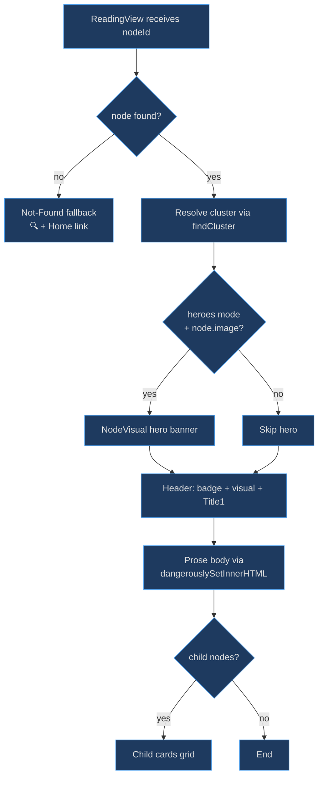
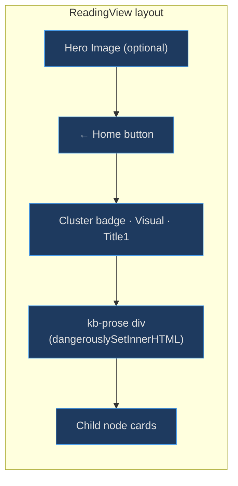

# Reading View

The Reading View exists because a knowledge graph is only useful if you can *read* the underlying content. While the HUD and graph visualisations show relationships, the Reading View is where users actually consume prose, browse child nodes, and orient themselves within a cluster. Routed by the [app shell](app-shell), it turns the raw `node.content` HTML into a styled, navigable reading experience.

## At a Glance

| Component | Responsibility | Key File | Source |
|-----------|---------------|----------|--------|
| `ReadingView` | Full reading page for a single node | `src/views/ReadingView.tsx` | [src/views/ReadingView.tsx:134](https://github.com/anokye-labs/kbexplorer/blob/main/src/views/ReadingView.tsx#L134) |
| `findCluster` | Merge config + computed cluster metadata | `src/views/ReadingView.tsx` | [src/views/ReadingView.tsx:23](https://github.com/anokye-labs/kbexplorer/blob/main/src/views/ReadingView.tsx#L23) |
| `NodeVisual` | Render emoji / sprite / hero images | `src/components/NodeVisual.tsx` | imported at line 15 |
| `useStyles` | Fluent `makeStyles` for layout | `src/views/ReadingView.tsx` | [src/views/ReadingView.tsx:32](https://github.com/anokye-labs/kbexplorer/blob/main/src/views/ReadingView.tsx#L32) |

## Rendering Pipeline

<!-- Sources: src/views/ReadingView.tsx:134-229 -->

## Page Layout Zones

<!-- Sources: src/views/ReadingView.tsx:159-226 -->

## Node Lookup and Not-Found Fallback

The component performs a simple linear search through the [`KBGraph`](type-system) nodes array at [src/views/ReadingView.tsx:136](https://github.com/anokye-labs/kbexplorer/blob/main/src/views/ReadingView.tsx#L136). When no node matches, a full-viewport not-found screen renders with a 🔍 emoji, an explanatory caption, and a Home button linking back to `#/` ([src/views/ReadingView.tsx:138-151](https://github.com/anokye-labs/kbexplorer/blob/main/src/views/ReadingView.tsx#L138)).

## Hero Image Rendering

When the visual mode is `'heroes'` and the node has an `image` property, a full-bleed [`NodeVisual`](visual-system) renders in `surface="hero"` mode at [src/views/ReadingView.tsx:162-164](https://github.com/anokye-labs/kbexplorer/blob/main/src/views/ReadingView.tsx#L162). The header shifts upward with a negative margin (`-8rem`) via the `headerHero` class to overlap the hero image.

## Header

The header section at [src/views/ReadingView.tsx:174-187](https://github.com/anokye-labs/kbexplorer/blob/main/src/views/ReadingView.tsx#L174) renders three elements:

| Element | Condition | Component |
|---------|-----------|-----------|
| Cluster badge | Always | Fluent `Badge` with `appearance="tint"` |
| Node visual | Sprite or emoji mode, no hero | `NodeVisual` with `surface="header"` |
| Title | Always | Fluent `Title1` |

## Prose Body

The node's pre-rendered HTML is injected via `dangerouslySetInnerHTML` at [src/views/ReadingView.tsx:192](https://github.com/anokye-labs/kbexplorer/blob/main/src/views/ReadingView.tsx#L192). The wrapper `
` carries the `.kb-prose` CSS class which provides the full Fluent 2 typography treatment from the [style system](style-system)'s `reading.css`.

## Child Node Listing

After the prose body, the component filters `graph.nodes` for nodes whose `parent === node.id` at [src/views/ReadingView.tsx:198](https://github.com/anokye-labs/kbexplorer/blob/main/src/views/ReadingView.tsx#L198). Each child renders as a clickable Fluent `Card` with:

- A `NodeVisual` thumbnail
- Bold title via `Body1Strong`
- A text preview (first 100 chars of `rawContent`, stripped of markdown syntax)
- A coloured bar indicating the child's cluster

Navigation uses hash links: `#/node/${encodeURIComponent(child.id)}` ([src/views/ReadingView.tsx:205](https://github.com/anokye-labs/kbexplorer/blob/main/src/views/ReadingView.tsx#L205)).

## findCluster Helper

The `findCluster` function at [src/views/ReadingView.tsx:23-30](https://github.com/anokye-labs/kbexplorer/blob/main/src/views/ReadingView.tsx#L23) merges cluster metadata from two sources — `config.clusters` (user-defined) and the computed `clusters` array — falling back to a neutral grey (`#888`) when neither has data for a given cluster ID.
