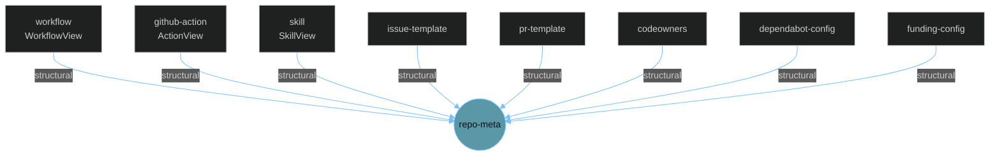

The **StructuralProvider** makes "almost everything in `.github`" a first-class graph citizen. It is the F3 layer (issue [#150](https://github.com/anokye-labs/kbexplorer-template/issues/150)), implemented in `src/engine/providers/structural-provider.ts`, and it turns workflows, actions, templates, ownership and config files into typed nodes on the open [node-type foundation](node-types) — siblings of the [content-model](content-model-ingestion) spine.

Every node it produces carries a `structural`-relation edge back to the repository node (`repo-meta`), so the repo sits at the centre of its own configuration constellation.

## Safe, additive, guarded

Like the content-model pipeline, the provider is a **safe no-op**: with no `.github` files it returns `{ nodes: [], edges: [] }`, so existing graphs are byte-identical. It declares a dependency on the `work` provider so the repository node exists before structural nodes attach to it.

## What gets discovered

Path classifiers in `structural-provider.ts` route each `.github` file to a per-kind builder:

| File pattern | `entityType` | JSON-LD `@type` | Viewer |
|--------------|--------------|-----------------|--------|
| `.github/workflows/*.yml` | `workflow` | `Workflow` | WorkflowView |
| `**/action.yml` | `github-action` | `SoftwareApplication` | ActionView |
| `.github/skills/**/SKILL.md`, `*.skill.md` | `skill` | `HowTo` | SkillView |
| `.github/ISSUE_TEMPLATE/**` | `issue-template` | `CreativeWork` | generic |
| `PULL_REQUEST_TEMPLATE.md` | `pr-template` | `CreativeWork` | generic |
| `CODEOWNERS` | `codeowners` | `StructuredConfig` | generic |
| `.github/dependabot.yml` | `dependabot-config` | `DependabotConfig` | generic |
| `.github/FUNDING.yml` | `funding-config` | `StructuredConfig` | generic |
| other `.github` config / docs | `github-config` / `structured-config` | varies | generic |

Anything that doesn't match a dedicated classifier falls through to `buildGenericConfigNode()`, which first tries the declarative [node map](node-mapping) (`node-map.yaml`) plus a heuristic structured mapper, then treats prose markdown (`SECURITY.md`, `SUPPORT.md`, …) as a documentation node.

## The new `skill` node

The newest structural type is `skill` — a Copilot / agent `SKILL.md` discovered under `.github/skills/**` (or any `*.skill.md`). `buildSkillNode()` parses the file's frontmatter, derives the name from the `name` field or the skill's directory, renders the guidance body to safe HTML, and emits an `entityType: 'skill'` node with JSON-LD `@type: 'HowTo'`. Its bespoke `SkillView` (`src/views/viewers/SkillView.tsx`) leads with the skill's most load-bearing field — the **when-to-use trigger** (`description`) that tells an agent when to reach for it — followed by the rendered body. The type and viewer are wired in `registerStructuralTypes()` exactly like `workflow` and `github-action`, with no change to any core union.

## Bespoke viewers

`registerStructuralTypes()` binds `workflow → WorkflowView`, `github-action → ActionView`, and `skill → SkillView`; every other structural kind uses `GenericStructuredView`, which renders any `data` / `jsonld` payload as a nested table/tree. The viewer-registry resolution rules are shared with the content-model spine — see [node types](node-types) and [UI node types](ui-node-types).

## Untrusted-markup escaping

Markup committed under `.github/` (issue/PR templates, `SECURITY.md`) is treated as **untrusted**: the provider uses a dedicated `marked` renderer that escapes raw embedded HTML before it ever reaches `dangerouslySetInnerHTML`, so a template can't inject script when its node renders. This is stricter than the app-wide markdown path used for [authored content](authored-provider).

## Identity and collisions

Each node uses a `urn:structural:<path>` identity (see [identity](identity)) and a deterministic, slugified id (`gh-workflow-…`, `gh-skill-…`). The provider guards against id collisions by suffixing duplicates, so two files that slugify alike never silently drop one another's edges.

## Build wiring

`scripts/generate-manifest.js` collects the `.github` files (and any `node-map.yaml`) into `manifest.structuralFiles`; the [local loader](local-loader) registers `new StructuralProvider(manifest.structuralFiles, manifest.structuredNodeMapRaw ?? null)` whenever structural files are present. Because this template ships a real `.github/` directory, these nodes render today — orbiting the repository node alongside the engine cluster.
