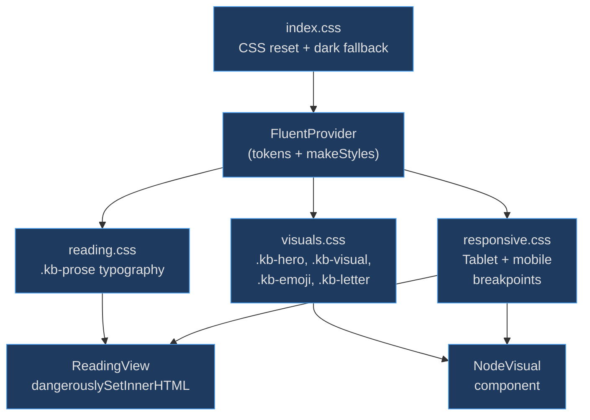

# CSS Style System

The CSS style system exists to bridge the gap between Fluent UI's component-level styling (via `makeStyles` and tokens) and the parts of the app that render raw HTML — particularly the prose body from `dangerouslySetInnerHTML`. These stylesheets ensure that markdown-generated content, hero images, visual thumbnails, and responsive breakpoints all follow Fluent 2 design language without requiring JS-in-CSS for every element.

## At a Glance

| Stylesheet | Purpose | Key File | Source |
|-----------|---------|----------|--------|
| `reading.css` | Prose typography for markdown HTML | `src/styles/reading.css` | [src/styles/reading.css:3](https://github.com/anokye-labs/kbexplorer/blob/main/src/styles/reading.css#L3) |
| `visuals.css` | Hero images, thumbnails, emoji/letter fallbacks | `src/styles/visuals.css` | [src/styles/visuals.css:4](https://github.com/anokye-labs/kbexplorer/blob/main/src/styles/visuals.css#L4) |
| `responsive.css` | Cross-cutting responsive breakpoints | `src/styles/responsive.css` | [src/styles/responsive.css:4](https://github.com/anokye-labs/kbexplorer/blob/main/src/styles/responsive.css#L4) |
| `index.css` | Minimal CSS reset + Fluent dark fallback | `src/index.css` | [src/index.css:17](https://github.com/anokye-labs/kbexplorer/blob/main/src/index.css#L17) |

## Style Layer Architecture



<!-- Sources: src/App.tsx:13-15, src/styles/ -->

## Custom Property Integration

```mermaid
flowchart LR
    [HUD — Heads-Up Display](hud)["HUD sliders"] -->|"set via JS"| Props["CSS custom properties"]
    Props --> PFS["--prose-font-size\n(default: 14px)"]
    Props --> PMW["--prose-max-width\n(default: 75%)"]
    PFS --> Prose[".kb-prose\nfont-size"]
    PMW --> Prose

    style HUD fill:#1e3a5f,stroke:#4a9eed,color:#e0e0e0
    style Props fill:#1e3a5f,stroke:#4a9eed,color:#e0e0e0
    style PFS fill:#1e3a5f,stroke:#4a9eed,color:#e0e0e0
    style PMW fill:#1e3a5f,stroke:#4a9eed,color:#e0e0e0
    style Prose fill:#1e3a5f,stroke:#4a9eed,color:#e0e0e0
```

<!-- Sources: src/styles/reading.css:3-8 -->

## .kb-prose (reading.css)

The `.kb-prose` class at [src/styles/reading.css:3-8](https://github.com/anokye-labs/kbexplorer/blob/main/src/styles/reading.css#L3) styles all markdown-rendered HTML. Key design decisions:

| Element | Styling | Fluent 2 Alignment |
|---------|---------|-------------------|
| `h1` | 24px / 600 weight / 32px line height | Title3 type ramp ([line 11](https://github.com/anokye-labs/kbexplorer/blob/main/src/styles/reading.css#L11)) |
| `h2` | 20px / 600 weight / 26px line height | Subtitle1 ([line 20](https://github.com/anokye-labs/kbexplorer/blob/main/src/styles/reading.css#L20)) |
| `h3` | 16px / 600 weight / 22px line height | Subtitle2 ([line 29](https://github.com/anokye-labs/kbexplorer/blob/main/src/styles/reading.css#L29)) |
| `code` | Cascadia Code, `colorNeutralBackground3` background | [line 82](https://github.com/anokye-labs/kbexplorer/blob/main/src/styles/reading.css#L82) |
| `pre` | 8px border radius, `colorNeutralStroke2` border | [line 91](https://github.com/anokye-labs/kbexplorer/blob/main/src/styles/reading.css#L91) |
| `blockquote` | `colorBrandStroke1` left border, `colorNeutralBackground3` | [line 68](https://github.com/anokye-labs/kbexplorer/blob/main/src/styles/reading.css#L68) |
| `a` | `colorBrandForegroundLink` + underline | [line 109](https://github.com/anokye-labs/kbexplorer/blob/main/src/styles/reading.css#L109) |
| `table` | `colorNeutralStroke2` borders, `colorNeutralBackground3` headers | [line 125](https://github.com/anokye-labs/kbexplorer/blob/main/src/styles/reading.css#L125) |

Font size and max width are controlled via CSS custom properties `--prose-font-size` and `--prose-max-width`, allowing the HUD reading tools to adjust them in real time.

## .kb-hero (visuals.css)

The hero image system at [src/styles/visuals.css:4-37](https://github.com/anokye-labs/kbexplorer/blob/main/src/styles/visuals.css#L4) provides:

- Full-bleed layout: `width: 100%`, height clamped between 300px and 680px (60vh)
- `object-fit: cover` for proportional scaling
- Dark gradient overlay transitioning from 10% opacity to solid `#1b1b1f`
- `heroReveal` animation: scale from 1.05 → 1.0 with opacity 0 → 1

## .kb-visual / .kb-emoji / .kb-letter (visuals.css)

Three visual fallback modes at different surface sizes:

| Class | Surfaces | Sizes |
|-------|----------|-------|
| `.kb-visual` | `card`, `header`, `hud-thumb`, `edge-preview`, `connection` | Varies with border variants |
| `.kb-emoji` | Same surfaces | card: 28px, header: 40px, hud-thumb: 20px |
| `.kb-letter` | Same surfaces | card: 48×48px, header: 80×80px, hud-thumb: 44×44px |

## Responsive Breakpoints (responsive.css)

Two breakpoints defined at [src/styles/responsive.css:4-36](https://github.com/anokye-labs/kbexplorer/blob/main/src/styles/responsive.css#L4):

| Breakpoint | Range | Key Changes |
|-----------|-------|-------------|
| Tablet | 769–1024px | Reduced padding (24px), smaller title (32px), tighter cluster spacing |
| Mobile | ≤768px | `overflow-x: hidden` on html/body, hero height reduced to 40vh/200px min |

## index.css Reset

The minimal reset at [src/index.css:1-37](https://github.com/anokye-labs/kbexplorer/blob/main/src/index.css#L1) sets `box-sizing: border-box`, zeroes margins/padding, and applies a dark fallback background (`#292929`) on `html` so the page doesn't flash white before FluentProvider mounts.
