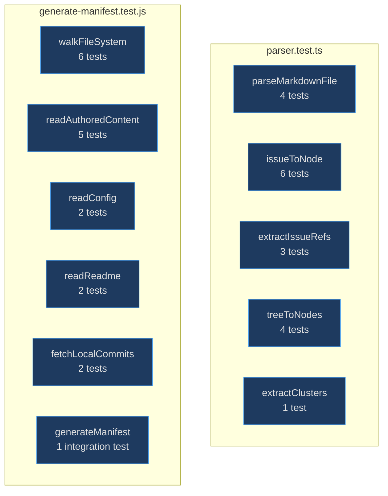
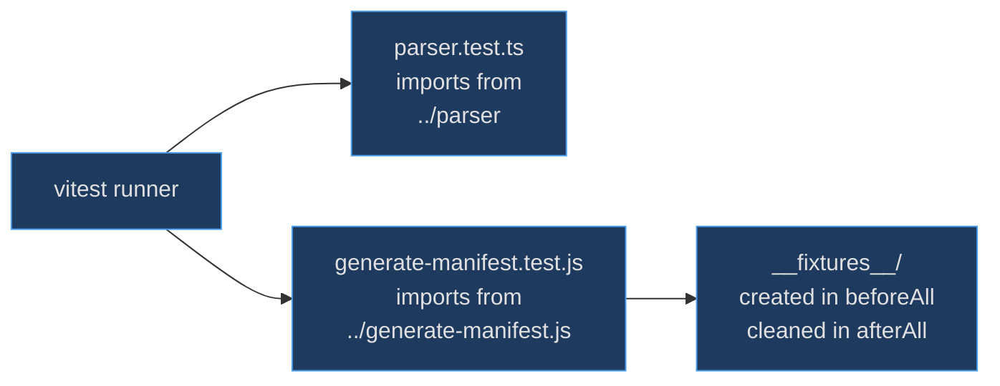

# Test Suite

The test suite exists to guard the two most critical code paths in kbexplorer: the [content pipeline](content-pipeline) (which parses markdown, issues, and file trees into `KBNode` arrays) and the [manifest generator](manifest-generator) (which snapshots a repository into JSON). These are the foundational data transformations — if they break, the entire knowledge graph renders incorrectly or not at all.

## At a Glance

| Test File | Scope | Runner | Source |
|-----------|-------|--------|--------|
| `parser.test.ts` | Content pipeline functions | vitest | [src/engine/__tests__/parser.test.ts:1](https://github.com/anokye-labs/kbexplorer/blob/main/src/engine/__tests__/parser.test.ts#L1) |
| `generate-manifest.test.js` | Manifest generator functions | vitest | [scripts/__tests__/generate-manifest.test.js:1](https://github.com/anokye-labs/kbexplorer/blob/main/scripts/__tests__/generate-manifest.test.js#L1) |
| `package.json` test script | `vitest` | npm | [package.json:10](https://github.com/anokye-labs/kbexplorer/blob/main/package.json#L10) |

## Test Coverage Map

<!-- Sources: src/engine/__tests__/parser.test.ts, scripts/__tests__/generate-manifest.test.js -->

## Test Architecture

<!-- Sources: scripts/__tests__/generate-manifest.test.js:15-36 -->

## parser.test.ts

Tests the content pipeline at [src/engine/__tests__/parser.test.ts:1](https://github.com/anokye-labs/kbexplorer/blob/main/src/engine/__tests__/parser.test.ts#L1):

### parseMarkdownFile (4 tests)

| Test | Assertion |
|------|-----------|
| Parses frontmatter and content | Correct `id`, `title`, `cluster`, `emoji`, `connections`, HTML `content`, source type `authored` |
| Generates id from filename | Fallback to filename-based slug when no `id` in frontmatter |
| Handles empty connections | Returns `[]` when no connections defined |
| Handles missing frontmatter | Falls back to `cluster: 'default'`, preserves raw content |

### issueToNode (6 tests)

| Test | Assertion |
|------|-----------|
| Creates node with correct id | `issue-42` format |
| Uses first label as cluster | Maps `bug` label to `bug` cluster |
| Extracts cross-references | `#10` and `#15` → connections to `issue-10`, `issue-15` |
| Renders body as HTML | Contains `
` tags |
| Handles null body | Empty `rawContent` and `connections` |
| Handles no labels | Falls back to `uncategorized` cluster |

### extractIssueRefs (3 tests)

| Test | Assertion |
|------|-----------|
| Extracts `#N` references | `'See #1 and #23'` → `[1, 23]` |
| Returns empty for null body | `null` → `[]` |
| Returns empty for no refs | `'No references here'` → `[]` |

### treeToNodes (4 tests)

| Test | Assertion |
|------|-----------|
| Creates repo-root node | `id: 'repo-root'` exists |
| Creates directory nodes | `dir-src` with `parent: 'repo-root'` |
| Creates file nodes | `file-src/App.tsx` with `parent: 'dir-src'` |
| Respects excludePaths | Excluding `'src'` removes `dir-src` and all children |

### extractClusters (1 test)

| Test | Assertion |
|------|-----------|
| Merges config + auto-detected | Auto-detected `custom` cluster gets a colour assigned |

## generate-manifest.test.js

Tests the manifest generator at [scripts/__tests__/generate-manifest.test.js:1](https://github.com/anokye-labs/kbexplorer/blob/main/scripts/__tests__/generate-manifest.test.js#L1). Uses a fixture directory created in `beforeAll` and cleaned in `afterAll`.

### walkFileSystem (6 tests)

| Test | Assertion |
|------|-----------|
| Produces entries | Files and directories present |
| Includes nested directories | `src/engine` tree entry found |
| Filters .git directory | No `.git` paths in output |
| Filters node_modules | No `node_modules` paths in output |
| Includes file sizes | `README.md` has `size > 0` |
| Non-existent directory | Returns empty array |

### readAuthoredContent (5 tests)

| Test | Assertion |
|------|-----------|
| Reads markdown files | 2 files found (overview + wiki/setup) |
| Keys by relative path | `content/overview.md` key exists |
| Reads nested content | `setup.md` in wiki/ subfolder found |
| Ignores non-md files | `.txt` files excluded |
| Non-existent directory | Returns empty object |

### readConfig / readReadme / fetchLocalCommits

| Suite | Tests | Key Assertions |
|-------|-------|----------------|
| readConfig | 2 | Reads from content dir; returns null when missing |
| readReadme | 2 | Reads README.md; returns null when missing |
| fetchLocalCommits | 2 | Returns array; objects have `sha`, `commit.message`, `commit.author.name` shape |

### generateManifest Integration (1 test)

Calls `generateManifest(FIXTURES)` and validates the assembled manifest has non-empty tree, correct README content, matching config, 2 authored content files, and all expected array fields present.
