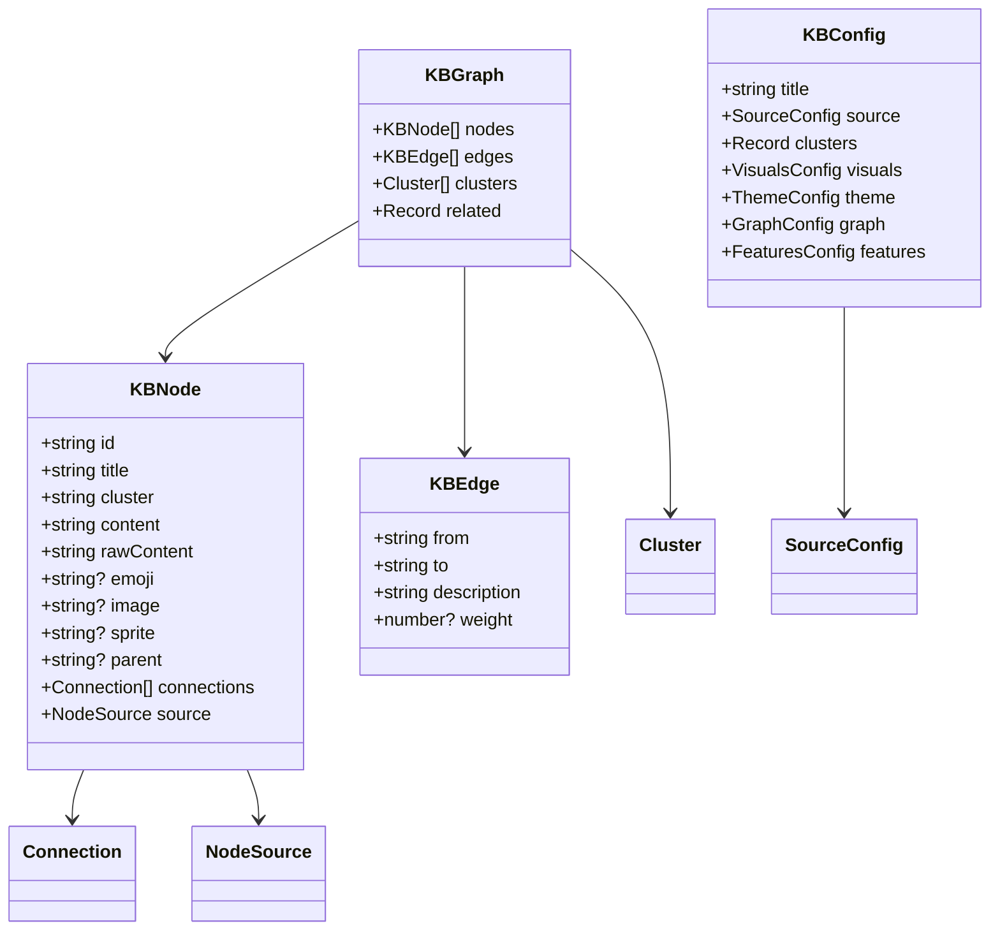
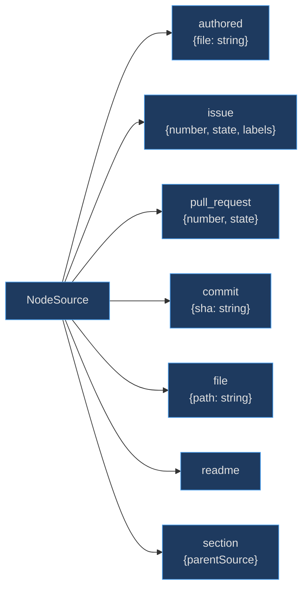

# Core Type Definitions

The type system exists to provide a single source of truth for every data shape in kbexplorer. By centralising types in `src/types/index.ts`, every module operates against the same contracts — the [graph engine](graph-engine) and [content pipeline](content-pipeline) consume `KBNode` and `KBGraph`, the [GitHub API client](github-api) uses `SourceConfig`, and UI components like the [HUD](hud), [application shell](app-shell), [reading view](reading-view), and [overview view](overview-view) all import from this single source — eliminating the class of bugs that come from shape mismatches between data producers and consumers.

## At a Glance

| Type | Purpose | Source |
|------|---------|--------|
| `KBNode` | A node in the knowledge graph | [src/types/index.ts:4](https://github.com/anokye-labs/kbexplorer/blob/main/src/types/index.ts#L4) |
| `Connection` | Edge description from frontmatter | [src/types/index.ts:20](https://github.com/anokye-labs/kbexplorer/blob/main/src/types/index.ts#L20) |
| `Cluster` | Cluster identity (id, name, colour) | [src/types/index.ts:25](https://github.com/anokye-labs/kbexplorer/blob/main/src/types/index.ts#L25) |
| `KBGraph` | Assembled graph: nodes + edges + clusters + related map | [src/types/index.ts:32](https://github.com/anokye-labs/kbexplorer/blob/main/src/types/index.ts#L32) |
| `KBEdge` | Weighted edge between nodes | [src/types/index.ts:39](https://github.com/anokye-labs/kbexplorer/blob/main/src/types/index.ts#L39) |
| `NodeSource` | Discriminated union for node origin | [src/types/index.ts:61](https://github.com/anokye-labs/kbexplorer/blob/main/src/types/index.ts#L61) |
| `KBConfig` | Full app configuration shape | [src/types/index.ts:71](https://github.com/anokye-labs/kbexplorer/blob/main/src/types/index.ts#L71) |
| `DEFAULT_CONFIG` | Fallback config from env vars | [src/types/index.ts:137](https://github.com/anokye-labs/kbexplorer/blob/main/src/types/index.ts#L137) |
| `VisualMode` | `'sprites' \| 'heroes' \| 'emoji' \| 'none'` | [src/types/index.ts:47](https://github.com/anokye-labs/kbexplorer/blob/main/src/types/index.ts#L47) |
| `Theme` | `'dark' \| 'light' \| 'sepia'` | [src/types/index.ts:50](https://github.com/anokye-labs/kbexplorer/blob/main/src/types/index.ts#L50) |

## Type Relationships

<!-- Sources: src/types/index.ts:4-119 -->

## NodeSource Discriminated Union

<!-- Sources: src/types/index.ts:61-68 -->

## KBNode Interface

Defined at [src/types/index.ts:4-18](https://github.com/anokye-labs/kbexplorer/blob/main/src/types/index.ts#L4), `KBNode` is the core entity:

| Field | Type | Purpose |
|-------|------|---------|
| `id` | `string` | Unique identifier (slug from filename or `issue-N`) |
| `title` | `string` | Display name |
| `cluster` | `string` | Cluster membership (maps to colour/grouping) |
| `content` | `string` | Pre-rendered HTML from markdown |
| `rawContent` | `string` | Original markdown source |
| `emoji` | `string?` | Unicode emoji or Fluent icon name |
| `image` | `string?` | Repo-relative path for heroes mode |
| `sprite` | `string?` | Repo-relative path for sprites mode |
| `parent` | `string?` | Parent node ID for hierarchical trees |
| `nodeType` | `'parent' \| 'section'?` | Whether this node has children or is a section |
| `connections` | `Connection[]` | Outgoing edges from frontmatter or auto-detection |
| `source` | `NodeSource` | Provenance: authored, issue, PR, commit, file, readme, or section |

## KBConfig Interface

The full configuration at [src/types/index.ts:71-119](https://github.com/anokye-labs/kbexplorer/blob/main/src/types/index.ts#L71) covers every aspect of the app:

| Section | Key Fields | Purpose |
|---------|-----------|---------|
| `source` | `owner`, `repo`, `branch`, `path?` | Which GitHub repo to load |
| `clusters` | `Record<string, {name, color}>` | Cluster display metadata |
| `visuals` | `mode`, `fallback`, `hero?`, `hud?`, `graph?` | Visual identity settings |
| `theme` | `default`, `font?` | Theme and typography |
| `graph` | `physics`, `layout` | Physics simulation and layout engine |
| `features` | `hud`, `minimap`, `readingTools`, `keyboardNav`, `sparkAnimation` | Feature flags |
| `bluf?` | `audio?`, `quote?`, `duration?` | Bottom-line-up-front overlay config |

## DEFAULT_CONFIG

The `DEFAULT_CONFIG` constant at [src/types/index.ts:137](https://github.com/anokye-labs/kbexplorer/blob/main/src/types/index.ts#L137) provides sensible defaults. The `resolveDefaultSource()` function at [src/types/index.ts:122](https://github.com/anokye-labs/kbexplorer/blob/main/src/types/index.ts#L122) reads `VITE_KB_OWNER`, `VITE_KB_REPO`, `VITE_KB_BRANCH`, and `VITE_KB_PATH` from `import.meta.env`, falling back to `anokye-labs/kbexplorer` when no env vars are set.

## KBEdge Weight

The `weight` field on `KBEdge` at [src/types/index.ts:43](https://github.com/anokye-labs/kbexplorer/blob/main/src/types/index.ts#L43) controls vis-network spring length: `springLength / weight`. A weight of `2` halves the rest length, pulling connected nodes closer. Default is `1`.
