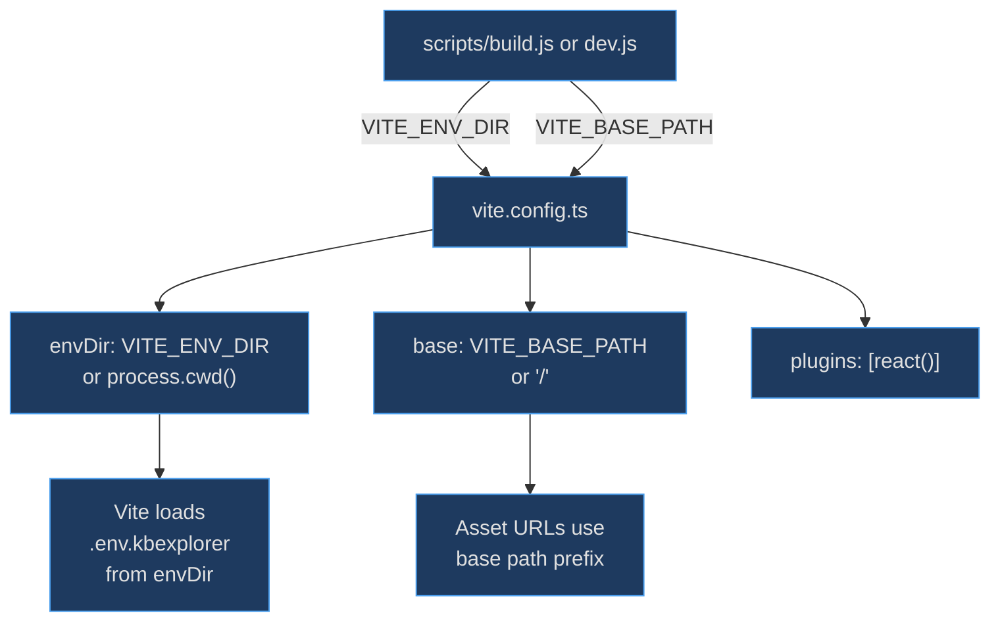
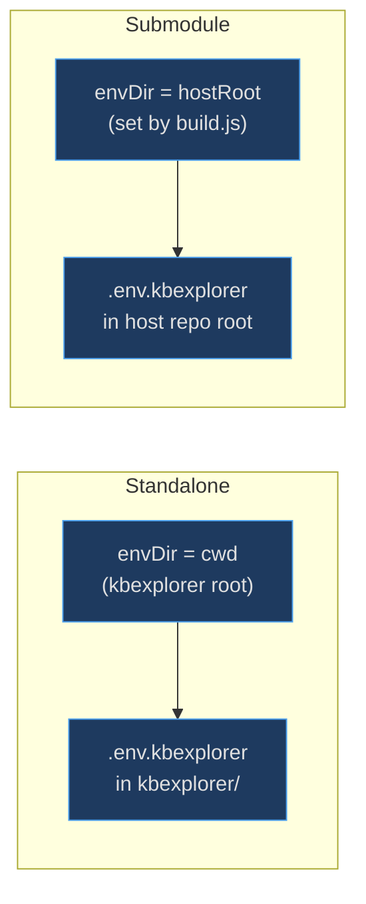

# Vite Configuration

Launched by the [build scripts](build-scripts), the Vite configuration handles two concerns that go beyond a standard React SPA setup: (1) loading environment variables from a configurable directory (critical for submodule mode where `.env.kbexplorer` lives in the host repo), and (2) supporting a configurable base path for subpath deployments on static hosting services.

## At a Glance

| Component | Responsibility | Key File | Source |
|-----------|---------------|----------|--------|
| `defineConfig` | Vite build configuration | `vite.config.ts` | [vite.config.ts:5](https://github.com/anokye-labs/kbexplorer/blob/main/vite.config.ts#L5) |
| `react()` plugin | React Fast Refresh + JSX transform | `vite.config.ts` | [vite.config.ts:7](https://github.com/anokye-labs/kbexplorer/blob/main/vite.config.ts#L7) |
| `base` | Configurable base path | `vite.config.ts` | [vite.config.ts:6](https://github.com/anokye-labs/kbexplorer/blob/main/vite.config.ts#L6) |
| `envDir` | Configurable env file directory | `vite.config.ts` | [vite.config.ts:8](https://github.com/anokye-labs/kbexplorer/blob/main/vite.config.ts#L8) |

## Configuration Flow



<!-- Sources: vite.config.ts:1-9, scripts/build.js:18-28 -->

## Submodule Env Loading



<!-- Sources: vite.config.ts:8, scripts/build.js:18 -->

## Configuration Options

The full config at [vite.config.ts:5-9](https://github.com/anokye-labs/kbexplorer/blob/main/vite.config.ts#L5):

```typescript
export default defineConfig({
  base: process.env.VITE_BASE_PATH ?? '/',
  plugins: [react()],
  envDir: process.env.VITE_ENV_DIR ?? process.cwd(),
})
```

| Option | Env Var | Default | Purpose |
|--------|---------|---------|---------|
| `base` | `VITE_BASE_PATH` | `'/'` | URL prefix for all assets — needed for deployments under a subpath (e.g., `/kb/`) |
| `plugins` | — | `[react()]` | `@vitejs/plugin-react` enables React Fast Refresh and JSX transform |
| `envDir` | `VITE_ENV_DIR` | `process.cwd()` | Directory where Vite looks for `.env*` files — set by `build.js`/`dev.js` to the host repo root in submodule mode |

## Why envDir Matters

Without `envDir`, Vite looks for `.env.kbexplorer` in the project root (the kbexplorer directory). In submodule mode, the init script writes `.env.kbexplorer` to the **host** repo root. The build/dev scripts pass `VITE_ENV_DIR=hostRoot` so Vite discovers the env file correctly. This chain — `init.js` → `.env.kbexplorer` → `build.js` → `VITE_ENV_DIR` → `vite.config.ts` — enables zero-copy env file resolution across the submodule boundary. In local mode, the build triggers the [manifest generator](manifest-generator) to snapshot repository data. The `VITE_KB_LOCAL` environment variable, loaded through `envDir`, enables the [local loader](local-loader) to bypass API calls entirely.
